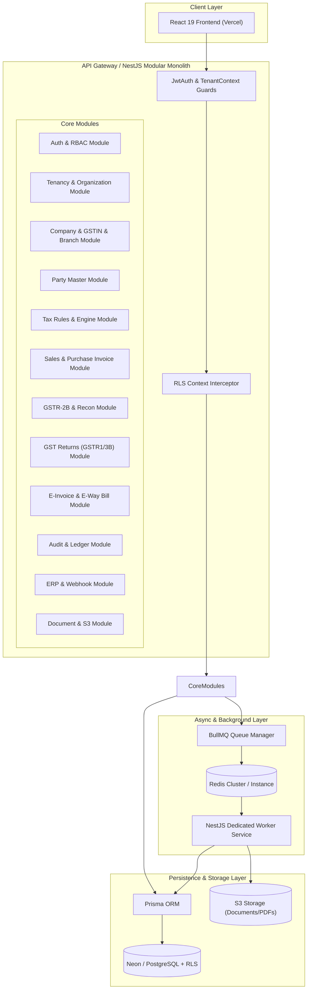

# TaxFlow NestJS Backend Architecture

## 1. Executive Summary & Design Vision
TaxFlow is undergoing a production-grade backend migration to a **NestJS Modular Monolith** coupled with **Prisma ORM**, **PostgreSQL/Neon**, **Redis + BullMQ**, and **S3-compatible Object Storage**.

The architecture strictly adheres to:
- **Tenant & Entity Hierarchy**: `Tenant` → `Company` → `GSTRegistration` (GSTIN) → `Branch` → `Transaction`.
- **Backend-Authoritative Security & Tax Logic**: Browser-supplied headers/payloads are never trusted for multi-tenant isolation or tax math.
- **Strict Decimal Precision**: `Decimal.js` / `Prisma.Decimal` / PostgreSQL `NUMERIC(16,4)` are enforced across all monetary and tax calculations.
- **Zero Frontend Disruption**: Frontend contracts and business behavior remain unchanged.

---

## 2. System Architecture Overview



---

## 3. NestJS Module Directory & Structure

```
backend/
├── src/
│   ├── app.module.ts
│   ├── main.ts
│   ├── worker.main.ts
│   ├── common/
│   │   ├── decorators/
│   │   │   ├── tenant-id.decorator.ts
│   │   │   ├── current-user.decorator.ts
│   │   │   └── roles.decorator.ts
│   │   ├── guards/
│   │   │   ├── jwt-auth.guard.ts
│   │   │   ├── tenant-context.guard.ts
│   │   │   └── rbac.guard.ts
│   │   ├── interceptors/
│   │   │   ├── rls-context.interceptor.ts
│   │   │   └── audit-logger.interceptor.ts
│   │   ├── filters/
│   │   │   └── http-exception.filter.ts
│   │   ├── pipes/
│   │   │   └── decimal-validation.pipe.ts
│   │   └── services/
│   │       ├── prisma.service.ts
│   │       └── s3.service.ts
│   ├── modules/
│   │   ├── auth/
│   │   ├── tenancy/
│   │   ├── companies/
│   │   ├── gstin/
│   │   ├── branches/
│   │   ├── parties/
│   │   ├── tax-engine/
│   │   ├── invoices/
│   │   ├── reconciliation/
│   │   ├── returns/
│   │   ├── einvoice/
│   │   ├── ewaybill/
│   │   ├── audit/
│   │   ├── erp-integration/
│   │   └── documents/
│   └── queues/
│       ├── report-generation.processor.ts
│       ├── recon-recomputation.processor.ts
│       ├── einvoice-sync.processor.ts
│       └── whatsapp-notification.processor.ts
```

---

## 4. Multi-Tenant Context Injection & RLS Architecture

Every HTTP request passes through `TenantContextGuard` and `RLSInterceptor`:

1. **JWT Verification**: The JWT token contains `tenantId`, `userId`, `roles`, and associated `companyIds`/`gstinIds`.
2. **Context Resolution**: The guard validates that any requested `companyId` or `gstinId` belongs strictly to the decoded `tenantId`.
3. **Database RLS Session**: The `RLSInterceptor` invokes `SET LOCAL app.current_tenant_id = 'tenant_xyz'` and `SET LOCAL app.current_company_id = 'comp_abc'` before executing queries inside a Prisma transaction wrapper.
4. **Defense in Depth**: Even if application logic fails to add `WHERE tenant_id = ...`, PostgreSQL RLS rejects any row not matching `app.current_tenant_id`.

---

## 5. Async Processing Engine (Redis + BullMQ)

- **API Instance**: Enqueues jobs (`reconciliation.queue`, `returns.queue`, `notification.queue`, `einvoice.queue`).
- **Worker Instance**: Dedicated process running `worker.main.ts` processing heavy jobs without blocking HTTP endpoints.
- **Reliability & Retry**: Exponential backoff (3 attempts default, 5 attempts for NIC government APIs), dead-letter queues (DLQ), and status logging.

---

## 6. S3-Compatible Storage Architecture

Documents (Invoice PDFs, Audit Trails, GSTR-2B JSON dumps, Excel exports) are saved to S3 bucket storage:
- Key pattern: `tenants/{tenantId}/companies/{companyId}/{year}/{month}/{category}/{fileId}.pdf`
- Presigned URLs with 15-minute expiration generated for client downloads.
- AES-256 server-side encryption enabled.
