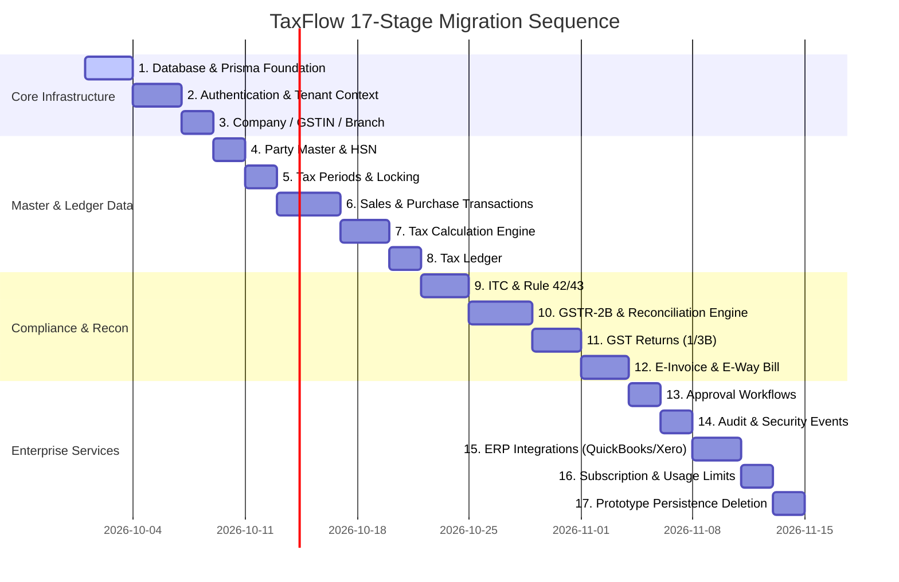

# TaxFlow Backend Migration Plan (KEEP → REFACTOR → REPLACE → REMOVE)

This document specifies the migration plan for transitioning TaxFlow from prototype/in-memory state to a production NestJS + PostgreSQL/Neon backend.

## 1. Migration Methodology: KEEP → REFACTOR → REPLACE → REMOVE

To ensure zero downtime and uninterrupted React frontend operations:

1. **KEEP**: Preserve all current API contracts (`/api/v1/...`), request/response JSON payload schemas, and frontend client calls (`services/api.ts`).
2. **REFACTOR**: Isolate pure domain logic (e.g. tax computation math in `gstEngine`, HSN rate lookup rules, reconciliation scoring logic) into pure TypeScript NestJS services.
3. **REPLACE**: Replace prototype mock storage/maps with Prisma ORM queries pointing to PostgreSQL/Neon.
4. **REMOVE**: Safely remove legacy mock data maps, `server.ts` prototype routes, and in-memory caches only after NestJS endpoints are verified and automated end-to-end integration tests pass.

---

## 2. 17-Stage Migration Sequence Execution Roadmap

### Stage Breakdown & Deliverables

#### Stage 1: Database + Prisma Foundation
- Initialize NestJS workspace & `@prisma/client`.
- Generate PostgreSQL DDL, composite indexes, and RLS functions.
- Configure local Docker PostgreSQL/Redis instances.

#### Stage 2: Authentication + Tenant Context
- Port JWT generation/validation to NestJS `@nestjs/jwt` & `Passport`.
- Implement `TenantContextGuard` and `RLSInterceptor`.
- Verify multi-tenant isolation via automated end-to-end tests.

#### Stage 3: Company / GSTIN / Branch
- Implement `CompanyModule`, `GstinModule`, `BranchModule`.
- Enforce compound unique key validations: `(tenantId, pan)`, `(tenantId, gstin)`.

#### Stage 4: Party Master & HSN
- Migrate party management APIs to `PartyModule`.
- Implement statutory HSN/SAC rate lookup engine with effective date filtering.

#### Stage 5: Tax Periods
- Implement period creation, status transitions (`OPEN` -> `LOCKED` -> `FILED`).
- Apply database trigger prevention against modifying locked periods.

#### Stage 6: Sales / Purchase Transactions
- Implement transactional invoice creation, line items, and Decimal calculations.
- Enforce compound foreign keys (`tenant_id`, `company_id`, `gstin_id`, `branch_id`).

#### Stage 7: Tax Engine
- Port backend-authoritative tax calculation logic (`computeGstTax()`).
- Verify tax rate versions, place of supply rules (IGST vs. CGST+SGST).

#### Stage 8: Tax Ledger
- Implement input tax credit (ITC) and output tax liability ledgers.
- Enforce immutable transaction ledger entries.

#### Stage 9: ITC & Reversals
- Implement ITC eligibility classification (Eligible, Ineligible, Blocked u/s 17(5)).
- Implement Rule 42/43 proportionate reversal engine.

#### Stage 10: GSTR-2B + Reconciliation
- Implement BullMQ async queue for GSTR-2B JSON ingest and auto-reconciliation.
- Port match scoring algorithm (Exact, Fuzzy, Invoice Date, Tax Amount Variance).

#### Stage 11: GST Returns
- Implement GSTR-1 and GSTR-3B summary generators.
- Implement JSON export generation for GST portal filing.

#### Stage 12: E-Invoice / E-Way Bill
- Implement NIC E-Invoice API integration service (IRN generation, QR code parsing).
- Implement E-Way Bill generation service.

#### Stage 13: Approval Workflows
- Implement multi-stage approval workflow matrix for high-value tax invoices.

#### Stage 14: Audit / Security
- Implement structural audit logging interceptor recording all mutation payloads.

#### Stage 15: ERP Integrations
- Implement sync connectors for QuickBooks, Xero, and Tally ERP.

#### Stage 16: Billing / Usage
- Implement plan quota enforcement (Invoice count limits, Recon volume caps).

#### Stage 17: Remove Prototype Persistence
- Deprecate in-memory arrays in `server.ts`.
- Direct 100% of API traffic through the NestJS modular monolith.

---

## 3. Verification & Rollback Plan

- **Parity Testing**: Run simultaneous test executions against legacy prototype and new NestJS APIs. Request/Response structures must achieve 100% field equality.
- **Rollback Mechanism**: `docker-compose` routing allows instantaneous traffic fallback to Express proxy if any critical defect occurs during migration.
