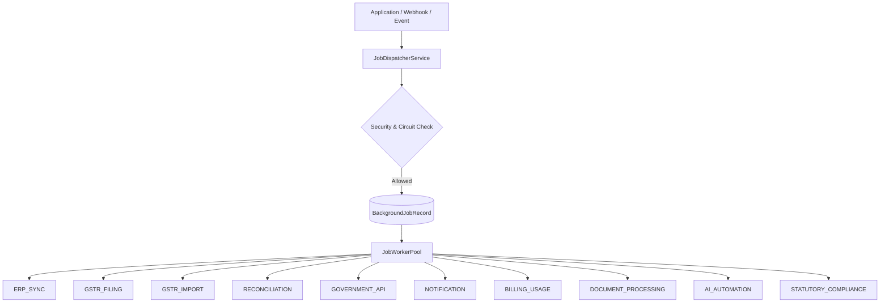

# TaxFlow — Stage 11 Background Jobs Architecture

## 1. Executive Summary

The Stage 11 Background Processing Architecture provides an enterprise-ready, asynchronous job execution framework across all TaxFlow domain modules. The system guarantees tenant isolation, security context propagation, durable idempotency, circuit breaker protection for external portals, and dead-letter queue recovery.

## 2. Workload Domain Consolidation

All background operations are consolidated into 10 distinct job domains (`JobDomain`):



### Domain Mapping Breakdown:
1. **`ERP_SYNC`**: ERP transaction import batches, CSV/Excel file ingestion, mapping sync runs.
2. **`GSTR_FILING`**: Async preparation, JSON payload generation, and government portal filing for GSTR-1 and GSTR-3B.
3. **`GSTR_IMPORT`**: GSTR-2B automated downloads, batch record insertion, and ITC categorization.
4. **`RECONCILIATION`**: High-volume 2B vs Purchase Register auto-matching algorithms.
5. **`GOVERNMENT_API`**: Direct E-Invoice IRN generation, E-Way Bill generation, cancellation, and GSP token refresh.
6. **`NOTIFICATION`**: Email notifications, SMS alerts, and WhatsApp message dispatching.
7. **`BILLING_USAGE`**: Subscription period boundary resets, usage meter aggregation, and past-due notification sweeps.
8. **`DOCUMENT_PROCESSING`**: PDF invoice rendering, compliance summary sheet exports, SHA-256 document hashing.
9. **`AI_AUTOMATION`**: Background HSN code classification, anomaly detection, and automated invoice matching suggestions.
10. **`STATUTORY_COMPLIANCE`**: Tax period lock enforcement, statutory audit snapshotting, and immutable hash validation.

---

## 3. Data Schema Model

Jobs and execution attempts are persisted within PostgreSQL via Prisma:

```prisma
model BackgroundJobRecord {
  id             String              @id @default(uuid()) @db.Uuid
  tenantId       String              @map("tenant_id") @db.Uuid
  userId         String?             @map("user_id") @db.Uuid
  domain         JobDomain
  jobType        String              @map("job_type") @db.VarChar(100)
  idempotencyKey String              @map("idempotency_key") @db.VarChar(255)
  status         BackgroundJobStatus @default(QUEUED)
  attempts       Int                 @default(0)
  maxAttempts    Int                 @default(3) @map("max_attempts")
  payload        Json                @db.JsonB
  result         Json?               @db.JsonB
  errorMessage   String?             @map("error_message") @db.Text
  correlationId  String              @map("correlation_id") @db.VarChar(100)
  lockedAt       DateTime?           @map("locked_at")
  lockedBy       String?             @map("locked_by") @db.VarChar(100)
  stalledAt      DateTime?           @map("stalled_at")
  createdAt      DateTime            @default(now()) @map("created_at")
  updatedAt      DateTime            @updatedAt @map("updated_at")
  completedAt    DateTime?           @map("completed_at")

  tenant Tenant             @relation(fields: [tenantId], references: [id], onDelete: Cascade)
  logs   JobExecutionLog[]

  @@unique([tenantId, idempotencyKey])
  @@index([tenantId, status])
  @@index([domain, status])
  @@map("background_job_records")
}
```

---

## 4. Execution Lifecycle

```text
  [Enqueued: QUEUED]
          │
          ▼
   [Lock & Start: PROCESSING]
          │
  ┌───────┴───────┐
  ▼               ▼
[COMPLETED]   [Error Encountered]
                  │
        ┌─────────┴─────────┐
        ▼                   ▼
 (Attempts < Max)    (Attempts >= Max)
        │                   │
  [Status: FAILED]   [Status: DEAD_LETTER]
 (Scheduled Retry)   (Moved to DLQ & Audit)
```
