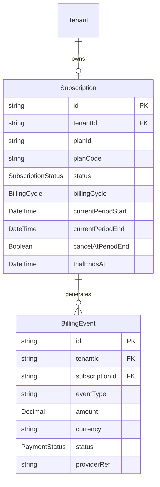

# TaxFlow — Stage 10 Billing Architecture

## 1. Executive Summary

The TaxFlow Billing Architecture provides a multi-tenant, enterprise-ready commercial engine for subscription lifecycle management, plan tiering, usage-based billing, and payment processing. The architecture enforces strict tenant isolation, data safety during plan modifications, and server-side authorization for all commercial features.

## 2. Domain Data Model & Persistence

The billing domain is modeled within PostgreSQL via Prisma, fully isolated by `tenantId`.



### Key Models:
- **`Subscription`**: Stores current plan assignment, billing period, auto-renewal flag, trial expiration, and subscription status (`TRIAL`, `ACTIVE`, `PAST_DUE`, `SUSPENDED`, `CANCELLED`, `EXPIRED`).
- **`BillingEvent`**: Immutable history of invoices, charges, refunds, payment attempts, and provider references.

---

## 3. Subscription Lifecycle & State Machine

Subscription state transitions are strictly governed by `SubscriptionLifecycleService`. Invalid transitions (e.g., directly moving from `EXPIRED` to `ACTIVE` without a successful payment event) are rejected.

```text
       ┌──────────┐
       │  TRIAL   │
       └────┬─────┘
            │ payment / trial convert
            ▼
       ┌──────────┐      payment fail      ┌──────────┐
       │  ACTIVE  │ ────────────────────► │ PAST_DUE │
       └────┬─────┘                        └────┬─────┘
            │                                   │ grace period elapsed
            │ cancel                            ▼
            │                              ┌───────────┐
            │ ───────────────────────────► │ SUSPENDED │
            │                              └────┬──────┘
            ▼                                   │ sub window ended
       ┌───────────┐                            ▼
       │ CANCELLED │                       ┌───────────┐
       └───────────┘                       │  EXPIRED  │
                                           └───────────┘
```

### State Machine Rules:
1. **`TRIAL`**: Initial state for new tenants with full/limited feature access. Automatically transitions to `EXPIRED` if no payment method is added before `trialEndsAt`.
2. **`ACTIVE`**: Full operational entitlement access granted based on active plan.
3. **`PAST_DUE`**: Triggered on payment failure. Enforces soft warning state while retrying payment over a 7-day grace period.
4. **`SUSPENDED`**: Triggered when past-due grace period expires. Restricts hard-gated write operations while leaving read/export operations available.
5. **`CANCELLED`**: Initiated by user or admin. Access remains active until `currentPeriodEnd` if `cancelAtPeriodEnd` is set.
6. **`EXPIRED`**: Terminated subscription state. Access falls back to `FREE` / `READ_ONLY` tier.

---

## 4. Data-Safe Upgrades & Downgrades

### Upgrade Workflow:
- Immediate entitlement modification.
- Period boundary adjust or proration calculated via payment provider.
- Immutable audit log entry created (`SUBSCRIPTION_UPGRADED`).

### Downgrade Workflow (Data Safety Assurance):
- **Zero Data Loss Guarantee**: A plan downgrade **never deletes historical business data** (e.g., existing invoices, GSTINs, branches, or users exceeding lower plan limits).
- **Excess Resource Soft Locking**: Resources created under a higher plan tier remain preserved in read-only/archived mode. New write operations or additions are blocked until resource counts fall within the new plan's limits.

---

## 5. Security, Tenant Isolation & Audit Integration

### Tenant Isolation:
- Every query filter incorporates `tenantId` extracted directly from authenticated JWT tokens.
- Cross-tenant subscription state mutations or payment webhooks targeting foreign tenants are blocked and reported as security violations.

### Immutable Audit Trail (Stage 8 Integration):
All commercial actions are logged to `ImmutableAuditLog` with SHA-256 hash chains:
- `SUBSCRIPTION_CREATED`
- `SUBSCRIPTION_UPGRADED`
- `SUBSCRIPTION_DOWNGRADED`
- `SUBSCRIPTION_CANCELLED`
- `SUBSCRIPTION_RENEWED`
- `PAYMENT_SUCCESSFUL`
- `PAYMENT_FAILED`
