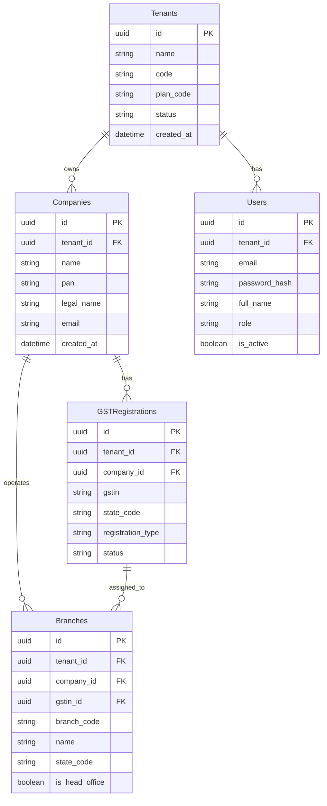
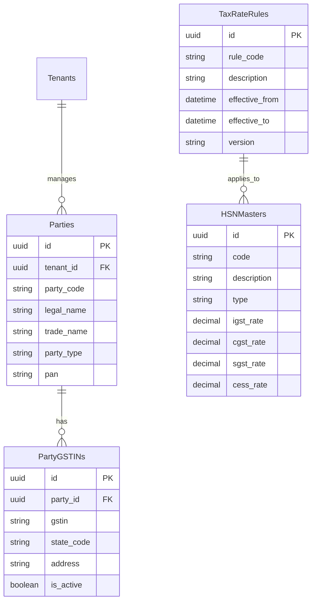
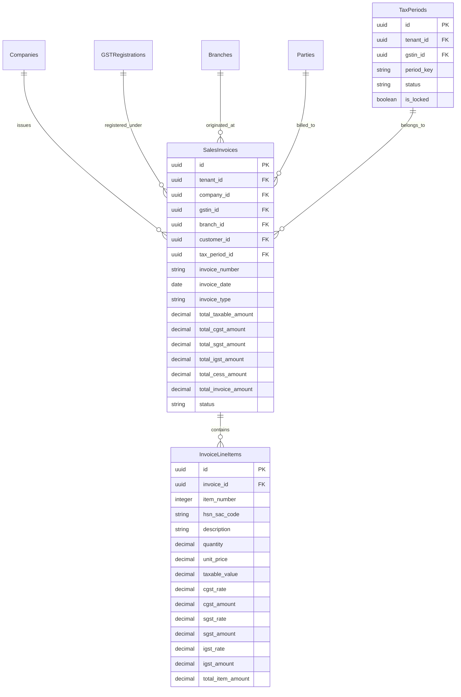
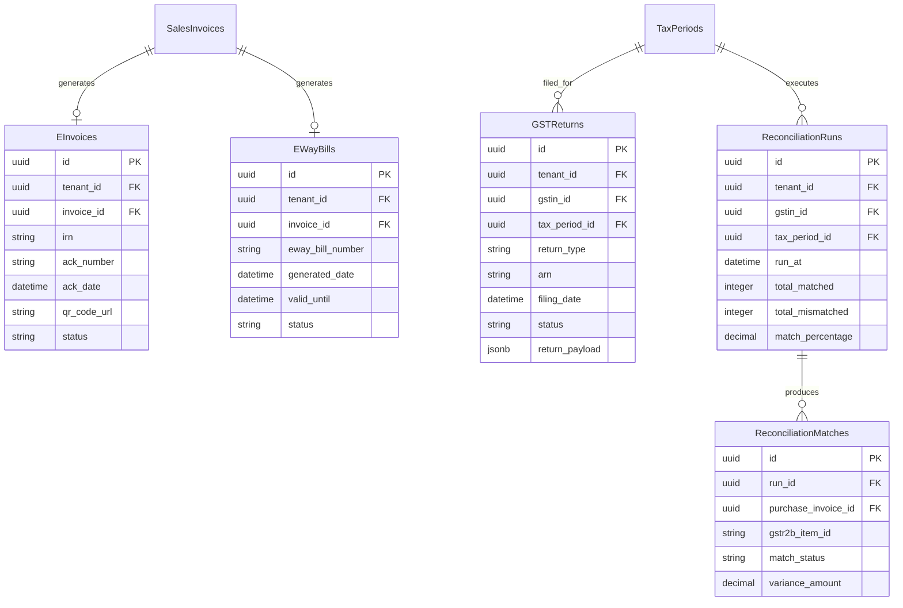

# TaxFlow Database Entity-Relationship Diagram (ERD)

This document presents the complete relational ERD for the TaxFlow PostgreSQL database.

## 1. Core Organizational Hierarchy

---

## 2. Party Master, HSN & Tax Rules

---

## 3. Invoices, Line Items & Tax Calculation Engine

---

## 4. GSTR-2B Reconciliation, Returns, E-Invoice & E-Way Bill

