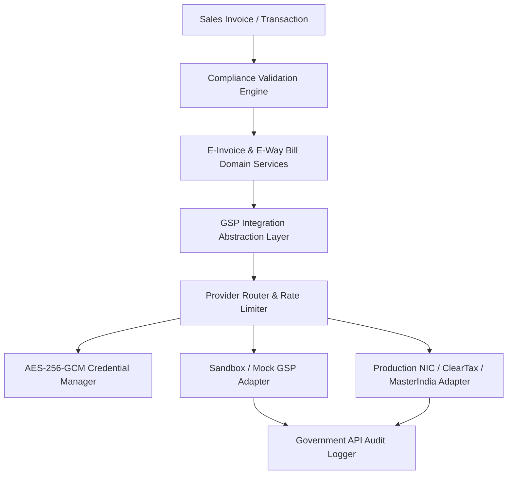

# Government Integration Architecture

**TaxFlow GST Compliance SaaS — Stage 7 Architecture Specification**

---

## 1. High-Level Integration Boundary

The Government & GSP (GST Suvidha Provider) integration layer provides an abstract, replaceable, provider-agnostic interface connecting TaxFlow's backend-authoritative transaction model to government portals (NIC E-Invoice portal & E-Way Bill portal).



### Strategic Principles
1. **Decoupled Boundary**: `SalesInvoice` and `InvoicesService` do NOT perform direct HTTP calls to government endpoints. All interactions are routed through `EInvoiceService` and `EWayBillService` down to `GspIntegrationAdapter`.
2. **Pluggable Provider Architecture**: Support for multiple GSP providers (`SANDBOX_MOCK`, `CLEAR_TAX`, `MASTER_INDIA`, `NIC_DIRECT`). Switching providers is done via configuration or tenant settings without modifying business logic.
3. **Strict Environment Segregation**: `SANDBOX` vs `PRODUCTION` environments are explicitly configured. Production credentials can never be sent to Sandbox endpoints or vice versa. Configuration ambiguities fail closed.
4. **Redacted Audit Trail**: Every outgoing request and incoming response is logged in `GovApiAuditLog` with strict credential redaction.

---

## 2. Abstraction Interfaces

```typescript
export interface GspAuthToken {
  accessToken: string;
  tokenType: string;
  expiresAt: Date;
}

export interface EInvoiceGenerateRequest {
  tenantId: string;
  gstinId: string;
  invoiceId: string;
  invoiceNumber: string;
  invoiceDate: string;
  sellerGstin: string;
  buyerGstin: string;
  taxableValue: number;
  cgstAmount: number;
  sgstAmount: number;
  igstAmount: number;
  totalInvoiceValue: number;
  items: Array<{
    hsnCode: string;
    description: string;
    taxableValue: number;
    gstRate: number;
  }>;
}

export interface EInvoiceGenerateResponse {
  success: boolean;
  irn?: string;
  ackNumber?: string;
  ackDate?: string;
  signedInvoice?: string;
  signedQrCode?: string;
  errorCode?: string;
  errorMessage?: string;
  rawResponse?: any;
}

export interface EWayBillGenerateRequest {
  tenantId: string;
  gstinId: string;
  invoiceId: string;
  eInvoiceId?: string;
  transporterId?: string;
  transporterName?: string;
  transportMode?: string;
  distanceKm?: number;
  vehicleNumber?: string;
  vehicleType?: string;
}

export interface EWayBillGenerateResponse {
  success: boolean;
  eWayBillNumber?: string;
  eWayBillDate?: string;
  validUntil?: string;
  errorCode?: string;
  errorMessage?: string;
  rawResponse?: any;
}

export interface GspIntegrationProvider {
  getProviderName(): string;
  getEnvironment(): 'SANDBOX' | 'PRODUCTION';
  generateIRN(req: EInvoiceGenerateRequest): Promise<EInvoiceGenerateResponse>;
  cancelIRN(irn: string, reason: string, remark: string): Promise<any>;
  generateEWayBill(req: EWayBillGenerateRequest): Promise<EWayBillGenerateResponse>;
  updateVehicleDetails(eWayBillNo: string, vehicleNo: string, reason: string): Promise<any>;
  cancelEWayBill(eWayBillNo: string, reason: string, remark: string): Promise<any>;
}
```

---

## 3. Data Flow & Security Controls

1. **Compliance Validation Gate**: Verification of statutory compliance rules (mandatory fields, valid buyer/seller GSTINs, positive taxable values, statutory tax balance) occurs *before* constructing GSP payloads.
2. **Statutory Immutability Locking**: Upon successful IRN generation, `isEInvoiceGenerated` and `isStatutoryLocked` are set to `true` on the `SalesInvoice`. Further modifications to statutory fields are blocked by database and service guards.
3. **Idempotency Execution**: Composite key `@@unique([tenantId, invoiceId])` on `EInvoiceRecord` prevents duplicate IRN generation attempts.
