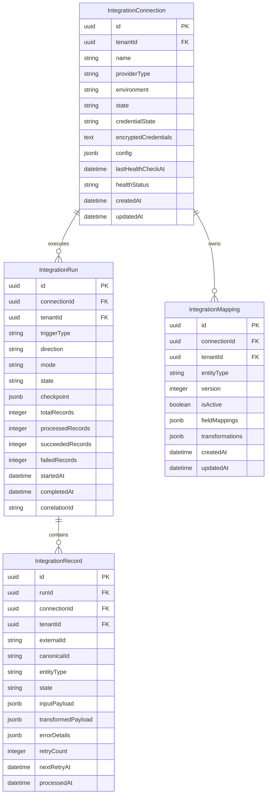
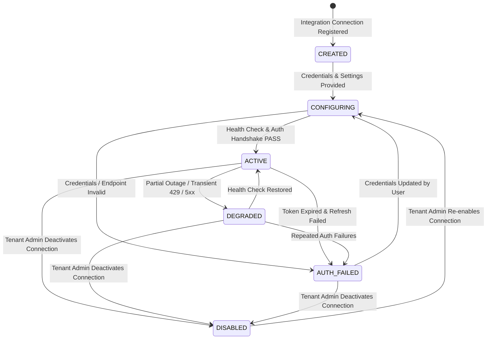
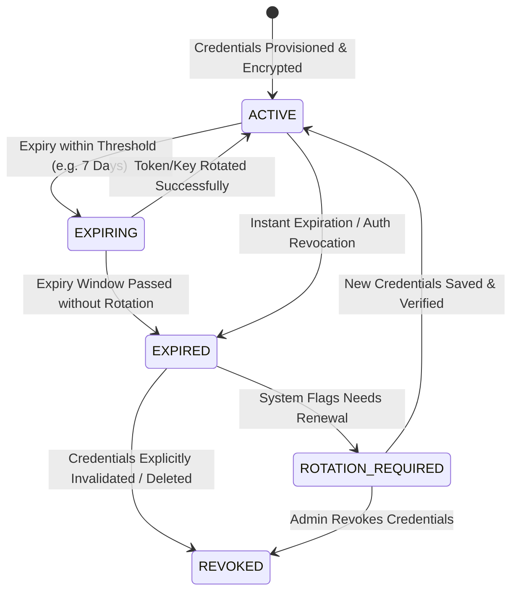
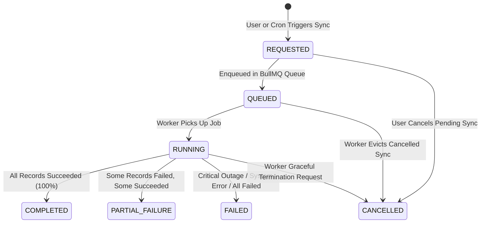
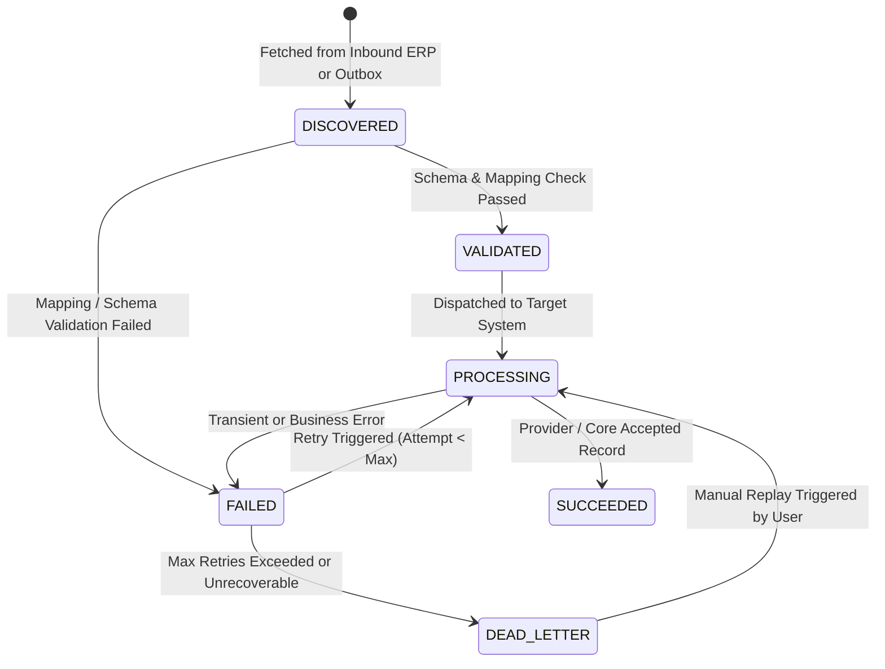

# Stage 15.6 — Integration Control Plane & Lifecycle Management Architecture & Design Specification

> **Branch:** `feature/stage-15-api-integration-platform`  
> **Status:** GATE A — ARCHITECTURE & DESIGN SPECIFICATION (IMPLEMENTATION FROZEN)  
> **Stage 14 Baseline:** Frozen in `main` branch awaiting live GSP provider access.  
> **Stage 15.1 – 15.5.9 Baseline:** Fully Approved & Closed (459/459 Automated Tests PASS).

---

## 1. Executive Summary & Foundational Alignment

Stage 15.6 introduces the **Integration Control Plane & Lifecycle Management** subsystem for TaxFlow GST SaaS. It acts as the central orchestration, control, lifecycle, and observability engine for all ERP adapters built in Stages 15.5.1 through 15.5.9 (Generic REST, SFTP/File, Dynamics 365 BC, Dynamics 365 F&O, SAP S/4HANA & ECC, Tally Prime, Zoho Books, and Oracle Fusion ERP).

The Control Plane provides tenant-isolated connection management, automated background synchronization, checkpoint recovery, granular record-level failure isolation, dead-letter queue (DLQ) replay, credential rotation, mapping versioning, and comprehensive health monitoring—without adding provider-specific logic to the core domain or duplicating existing core infrastructure.

```
+---------------------------------------------------------------------------------------------------+
|                                 TAXFLOW INTEGRATION CONTROL PLANE                                 |
|                                            (Stage 15.6)                                           |
+---------------------------------------------------------------------------------------------------+
|  Connection Manager  |  Sync Orchestrator  |  Health Monitor  |  Mapping Engine  |  DLQ / Replay  |
+---------------------------------------------------------------------------------------------------+
                                                  |
                                                  v
+---------------------------------------------------------------------------------------------------+
|                                 INTEGRATION ADAPTER FRAMEWORK                                    |
|                                       (Stages 15.5.1 - 15.5.9)                                    |
+---------------------------------------------------------------------------------------------------+
| Dynamics365 BC | Dynamics365 F&O | SAP S/4HANA | Tally Prime | Zoho Books | Oracle Fusion | SFTP / REST |
+---------------------------------------------------------------------------------------------------+
                                                  |
                                                  v
+---------------------------------------------------------------------------------------------------+
|                                   SHARED CORE INFRASTRUCTURE                                      |
+---------------------------------------------------------------------------------------------------+
| Stage 2: RLS Tenant Context  | Stage 8: Audit Trail      | Stage 10: Usage Metering & Entitlements|
| Stage 11: BullMQ Workers      | Stage 13: AES-256 Crypto  | Stage 15.1/15.4: API & Dev Portal       |
| Stage 15.2: Outbox Events    | Stage 15.3: Webhooks      | Stage 14: Health & Readiness Probes    |
+---------------------------------------------------------------------------------------------------+
```

---

## 2. Architectural Principles

Stage 15.6 strictly adheres to the following foundational principles:

- **Principle A**: **Canonical Model Protection** — Do not modify the frozen `CanonicalERPInvoiceDto` merely to accommodate a specific provider. Provider idiosyncrasies must remain encapsulated inside adapter boundaries.
- **Principle B**: **Infrastructure Non-Duplication** — Reuse existing infrastructure built in Stages 8, 10, 11, 13, 14, and 15. Do not recreate audit logging, entitlement checking, queue management, or cryptography modules.
- **Principle C**: **Adapter Decoupling** — The Control Plane orchestrates existing adapters (`IntegrationAdapter`); it does not contain provider-specific mapping or network logic.
- **Principle D**: **Server-Authoritative Tenant Isolation** — Tenant context is established via NestJS `TenantContextGuard` and PostgreSQL Row-Level Security (RLS). Callers can never select cross-tenant connections or bypass RLS boundaries.
- **Principle E**: **Encrypted Credential Binding** — Credentials remain encrypted using Stage 13 AES-256-GCM and bound strictly to the owning `tenantId`.
- **Principle F**: **Resumable & Idempotent Sync** — Sync operations use atomic checkpoints/cursors to resume seamlessly after interruptions without duplicating processed transactions.
- **Principle G**: **End-to-End Distributed Traceability** — Every operation carries a unified trace context consisting of `tenantId`, `connectionId`, `runId`, and W3C/OpenTelemetry `correlationId`.
- **Principle H**: **Atomic Record Isolation** — Individual record failures within a batch sync do not fail the entire batch. Failed records are independently recoverable without replaying succeeded records.
- **Principle I**: **Canonical Error Normalization** — All provider errors are normalized through `ERPProviderException` into canonical RFC 7807 problem details.
- **Principle J**: **Unified Entitlement & Rate Control** — Integrates with Stage 10 Redis sliding-window metering and entitlement quotas rather than building parallel rate-limiting logic.
- **Principle K**: **Background Job Execution** — Uses Stage 11 BullMQ job infrastructure and worker processes for scheduled and asynchronous tasks.
- **Principle L**: **Immutable Audit Logging** — Emits audit records via Stage 8 `AuditService` for every connection mutation, credential access, sync execution, and manual replay.
- **Principle M**: **Outbox Event Integration** — Emits status changes and sync completion events via Stage 15.2 `OutboxMessage` transactional outbox.
- **Principle N**: **Webhook Platform Reuse** — Dispatches external notifications using Stage 15.3 `WebhookDeliveryService`.
- **Principle O**: **API Platform Alignment** — Exposes REST endpoints via Stage 15.1 Public API platform and Stage 15.4 Developer Portal.
- **Principle P**: **No Redundant Orchestration** — Relies on NestJS modules, Prisma transactions, and BullMQ queues without introducing unnecessary external orchestration frameworks.

---

## 3. Explicit Non-Goals

1. **No Direct ERP API Calls**: The Control Plane never directly formats OData, BAPI, IDoc, SOAP, or REST payloads for specific ERP vendors. All provider interaction goes through the registered `IntegrationAdapter`.
2. **No Alteration of Canonical DTO**: The Control Plane does not add ERP-specific attributes to `CanonicalERPInvoiceDto`.
3. **No Standalone Queue Manager**: The Control Plane will not replace BullMQ or deploy an independent broker.
4. **No Standalone Webhook Engine**: Webhook notifications must route through the Stage 15.3 delivery pipeline.
5. **No Production ERP Certification Claims**: Stage 15.6 validates control plane orchestration contracts under mock environments. Live certification remains deferred until actual vendor sandboxes are available.

---

## 4. Existing Infrastructure Reuse Matrix

| Subsystem | Source Stage | Reuse Strategy in Stage 15.6 |
|---|---|---|
| **Tenant Isolation & RLS** | Stage 2 / Stage 13 | All Control Plane database tables (`integration_connections`, `integration_runs`, `integration_records`, `integration_mappings`) enforce PostgreSQL RLS policies bounded by `tenant_id`. |
| **Audit Trail** | Stage 8 | `AuditService.log()` called for connection lifecycle state changes, credential rotation, manual sync triggers, mapping changes, and DLQ replay actions. |
| **Usage & Entitlements** | Stage 10 | `EntitlementGuard` and `UsageMeteringService` verify tenant plan limits (e.g. max active ERP connections, monthly sync transaction volumes). |
| **Queue & Worker Engine** | Stage 11 | BullMQ queues (`integration-sync-queue`, `integration-health-queue`, `integration-dlq-queue`) handle async sync execution, health polling, and retries. |
| **Cryptography & Key Store**| Stage 13 | `EncryptionService.encrypt()` and `decrypt()` manage ERP API keys, OAuth client secrets, tokens, and basic auth credentials at rest. |
| **Observability & Probes** | Stage 14 | Control Plane health checks wire into `/health/ready` and `/health/live` health indicators. |
| **Public API Platform** | Stage 15.1 | Control Plane REST APIs use standardized RFC 7807 errors, pagination, versioning (`/v1/integrations/...`), and rate-limiting. |
| **Transactional Outbox** | Stage 15.2 | State changes in `IntegrationRun` write `OutboxMessage` records inside the active Prisma database transaction. |
| **Webhook Platform** | Stage 15.3 | Event outbox triggers dispatches to tenant-configured webhooks (e.g. `integration.sync.completed`, `integration.run.failed`). |
| **Developer Portal** | Stage 15.4 | Exposes connection status dashboards, mapping editors, health metrics, and manual replay buttons in the developer portal UI. |
| **Adapter Framework** | Stage 15.5.1–9 | Resolves adapters dynamically via `ERPAdapterRegistryService` based on `connection.providerType`. |

---

## 5. Domain Model & Entity Definitions

The Control Plane adds four primary database entities to the Prisma schema:



---

## 6. Core Lifecycle State Machines

### 6.1 Connection Lifecycle State Machine



| Current State | Target State | Trigger / Event | Action Taken |
|---|---|---|---|
| `CREATED` | `CONFIGURING` | Credentials submitted | Encrypt credentials via Stage 13 AES-256; validate config schema |
| `CONFIGURING` | `ACTIVE` | Handshake test succeeds | Adapter `testConnection()` returns `HEALTHY`; emit outbox event |
| `CONFIGURING` | `AUTH_FAILED` | Handshake test fails | Capture error; notify developer portal; block sync scheduling |
| `ACTIVE` | `DEGRADED` | Health check returns `DEGRADED` | Rate limit / 429 or 5xx detected; enable exponential backoff |
| `DEGRADED` | `ACTIVE` | Health check returns `HEALTHY` | Resume normal sync scheduling; reset error counters |
| `ACTIVE` / `DEGRADED` | `AUTH_FAILED` | 401/403 or token refresh fail | Pause active sync jobs; alert tenant admin; log security audit |
| `ACTIVE` / `DEGRADED` | `DISABLED` | User deactivates connection | Cancel pending BullMQ sync jobs; mark state as `DISABLED` |
| `DISABLED` | `CONFIGURING` | User re-enables connection | Request credential re-validation; initiate connection handshake |

---

### 6.2 Credential Lifecycle State Machine



---

### 6.3 Synchronization Run State Machine



| Current State | Target State | Trigger / Event | Behavior |
|---|---|---|---|
| `REQUESTED` | `QUEUED` | Job enqueued | Validate Stage 10 plan entitlements; obtain Redis lock |
| `QUEUED` | `RUNNING` | Worker picks job | Initialize `IntegrationRun`; record start time & checkpoint |
| `RUNNING` | `COMPLETED` | Batch finished, 0 failures | Save final cursor checkpoint; set `completedAt`; emit outbox event |
| `RUNNING` | `PARTIAL_FAILURE` | Batch finished, >0 failures | Mark failed records; enqueue eligible retries; notify webhooks |
| `RUNNING` | `FAILED` | Connection error / crash | Rollback active batch transaction; mark run failed; save cursor |
| Any active state | `CANCELLED` | Admin cancellation | Abort active loop; release Redis execution lock; mark cancelled |

---

### 6.4 Record Lifecycle State Machine



---

## 7. Synchronization & Checkpoint Architecture

### 7.1 Sync Modes & Directions
- **Directions**:
  - `OUTBOUND`: TaxFlow Canonical Invoices $\longrightarrow$ ERP System (push).
  - `INBOUND`: ERP Invoices $\longrightarrow$ TaxFlow Canonical Model (pull).
- **Modes**:
  - `FULL`: Scans complete dataset within date window; ignores prior cursor.
  - `INCREMENTAL`: Queries provider or outbox using saved `checkpoint` (timestamp/watermark/ID cursor).

### 7.2 Sync Checkpoint / Cursor Structure
Checkpoint state is stored atomically in `IntegrationRun.checkpoint` (JSONB) and updated at the end of each processed batch:

```json
{
  "lastProcessedId": "INV-2026-09941",
  "lastTimestamp": "2026-10-03T15:30:00.000Z",
  "batchSequence": 14,
  "pageSize": 50,
  "providerCursor": "opaque_oracle_hasMore_token_9841",
  "watermarkField": "updatedAt"
}
```

### 7.3 Resumable Execution & Crash Recovery
If a BullMQ worker crashes mid-run:
1. The lock expires in Redis. BullMQ re-assigns the job to a new worker.
2. The new worker loads the `IntegrationRun` entity and reads the last committed `checkpoint`.
3. The sync resumes fetching from `checkpoint.lastTimestamp` / `checkpoint.lastProcessedId`.
4. Already `SUCCEEDED` records in `IntegrationRecord` are skipped via primary key / natural key lookup (`tenantId` + `externalId` / `canonicalId`), guaranteeing **at-least-once execution with exact-once outcome**.

---

## 8. Record-Level Isolation, DLQ & Replay Engine

### 8.1 Batch Isolation Mechanism
When processing a batch of 100 records:
- Each record execution is wrapped in an isolated try-catch block.
- Database writes for individual target records execute in independent sub-transactions or atomic calls.
- A single bad record (e.g. invalid tax GSTIN) triggers a record-level state change to `FAILED`, while the remaining 99 records process to `SUCCEEDED`.

### 8.2 Dead-Letter Queue (DLQ) & Manual Replay
- Records transitioning to `DEAD_LETTER` are isolated in `IntegrationRecord` with `state = 'DEAD_LETTER'`.
- The Developer Portal exposes a DLQ Replay interface.
- **Independent Replay**: Admin can fix the underlying data or mapping configuration and trigger a targeted replay for specific `recordId`s without re-running successful records in the original `IntegrationRun`.

---

## 9. Mapping Engine & Versioning

### 9.1 Dynamic Field Mapping Model
`IntegrationMapping` defines rules for translating fields between canonical DTOs and external provider payloads:

```json
{
  "entityType": "INVOICE",
  "version": 2,
  "isActive": true,
  "fieldMappings": [
    {
      "canonicalField": "invoiceNumber",
      "erpField": "TransactionNumber",
      "direction": "BOTH",
      "required": true
    },
    {
      "canonicalField": "totalAmount",
      "erpField": "HeaderAmount",
      "direction": "OUTBOUND",
      "transform": "TO_NUMBER"
    }
  ],
  "transformations": {
    "dateFormat": "YYYY-MM-DD",
    "currencyDefault": "INR"
  }
}
```

### 9.2 Mapping Versioning Rules
- Creating or editing a mapping creates a new version increment (`version = version + 1`).
- Only one mapping per `(connectionId, entityType)` can have `isActive = true`.
- Historical `IntegrationRun` records store `mappingVersion` to ensure deterministic auditability for historical syncs.

---

## 10. Answers to 15 Authoritative Architecture Questions

1. **What is the authoritative source of integration state?**  
   The PostgreSQL database, specifically the RLS-enforced `integration_connections`, `integration_runs`, and `integration_records` tables. Redis holds ephemeral execution locks and BullMQ job states, but PostgreSQL is the source of truth.
2. **Where is the sync checkpoint stored?**  
   In `IntegrationRun.checkpoint` (JSONB column in PostgreSQL), updated atomically upon completing each batch slice.
3. **How is concurrent synchronization prevented from duplicating records?**  
   Distributed Redis lock key `lock:integration:sync:{tenantId}:{connectionId}` acquired via Redlock algorithm before run start. Additionally, a database-level unique constraint on `(tenantId, connectionId, runId, externalId)` prevents duplicate record insertion.
4. **How is a failed record replayed independently?**  
   Via the `ReplayRecordService`, which fetches the specific `IntegrationRecord` by ID, extracts its `inputPayload`, re-applies mapping rules, invokes the adapter, and updates the record state without modifying other records.
5. **How are successful records protected from replay?**  
   Records in state `SUCCEEDED` are locked from re-execution. Deduplication checks compare `(tenantId, connectionId, externalId, canonicalId)` against existing `SUCCEEDED` entries.
6. **How does a tenant prove ownership of a connection?**  
   Every request must carry a verified tenant JWT / API key matching the authenticated NestJS `TenantContext`. PostgreSQL Row Level Security (RLS) automatically appends `WHERE tenant_id = current_setting('app.current_tenant_id')` to all SQL queries.
7. **How does the control plane enforce Stage 10 entitlements?**  
   Before queueing a run or adding a connection, `EntitlementGuard` checks `UsageMeteringService.checkQuota(tenantId, 'ERP_SYNC_VOLUME')` and `checkFeature(tenantId, 'ERP_INTEGRATION_MODULE')`.
8. **How does it interact with Stage 11 workers?**  
   Enqueues sync tasks into BullMQ queue `integration-sync-queue`. Stage 11 `IntegrationSyncProcessor` consumes jobs, invokes the Control Plane service, handles concurrency, and reports back job progress.
9. **How does it consume Stage 15.2 events?**  
   Subscribes to `OutboxMessage` table changes for canonical events (e.g. `taxflow.einvoice.irn_generated`). The outbox worker filters events by matching active `IntegrationConnection` rules and enqueues outbound sync runs.
10. **How does it invoke the Stage 15.5 adapters?**  
    Injects `ERPAdapterRegistryService.getAdapter(connection.providerType)`, returning the corresponding `IntegrationAdapter` instance, and calls unified methods (`pushInvoices`, `pullInvoices`, `testConnection`).
11. **How are provider-specific capabilities exposed without leaking provider-specific models?**  
    Via `adapter.getCapabilities()`, returning standard boolean feature flags (`supportsInbound`, `supportsOutbound`, `supportsBatch`, `supportsWebhooks`, `authTypes`) without exposing internal vendor DTOs.
12. **How are credential rotation and OAuth refresh handled?**  
    `CredentialManagerService` inspects token expiration before each run. If expired/expiring, it executes the adapter's `refreshToken()` method, encrypts the new tokens via Stage 13 `EncryptionService`, and persists them in a single database transaction.
13. **How are provider outages represented?**  
    The connection state transitions to `DEGRADED` (for 429 rate-limiting / transient 5xx) or `AUTH_FAILED` (for persistent auth failures). Health metrics report error rates and average response latency.
14. **How are rate limits coordinated across workers?**  
    Workers pass requests through a Redis token-bucket rate limiter per connection (`rate_limit:erp:{connectionId}`). If a worker receives an HTTP 429 with `Retry-After`, it pauses the shared connection token bucket in Redis.
15. **How are all operations audited?**  
    Every state change, manual sync trigger, credential rotation, and DLQ replay action calls `AuditService.log()` to write an immutable append-only record in the Stage 8 audit log.

---

## 11. Security Threat Model & Protections

| Threat | Impact | Mitigation Strategy |
|---|---|---|
| **Cross-Tenant Connection Hijacking** | Critical | PostgreSQL RLS + NestJS `TenantContextGuard` forces `tenant_id` filtering at database & application layers. |
| **Credential Theft at Rest** | Critical | Credentials encrypted using AES-256-GCM via Stage 13 `EncryptionService`. Plaintext keys are never logged or stored. |
| **SSRF via Custom Token Endpoint** | High | Dynamic OAuth `tokenUrl` validated against `SsrfGuardService.validateWebhookUrl()` (blocks internal IPs / RFC 1918 addresses). |
| **Replay Attack / Duplicate Invoices** | High | Natural key deduplication (`tenantId` + `connectionId` + `externalId`) + idempotency keys on outbound requests. |
| **Denial of Service via Sync Flooding** | Medium | Stage 10 plan quotas + BullMQ concurrency limits per tenant. |

---

## 12. Complete Database Schema Changes

Added to `prisma/schema.prisma`:

```prisma
enum ConnectionState {
  CREATED
  CONFIGURING
  ACTIVE
  DEGRADED
  AUTH_FAILED
  DISABLED
}

enum CredentialState {
  ACTIVE
  EXPIRING
  EXPIRED
  ROTATION_REQUIRED
  REVOKED
}

enum RunState {
  REQUESTED
  QUEUED
  RUNNING
  COMPLETED
  PARTIAL_FAILURE
  FAILED
  CANCELLED
}

enum RecordState {
  DISCOVERED
  VALIDATED
  PROCESSING
  SUCCEEDED
  FAILED
  DEAD_LETTER
}

model IntegrationConnection {
  id                 String            @id @default(uuid()) @db.Uuid
  tenantId           String            @map("tenant_id") @db.Uuid
  name               String            @db.VarChar(100)
  providerType       String            @map("provider_type") @db.VarChar(50)
  environment        String            @default("PRODUCTION") @db.VarChar(20)
  state              ConnectionState   @default(CREATED)
  credentialState    CredentialState   @default(ACTIVE) @map("credential_state")
  encryptedCredentials String          @map("encrypted_credentials") @db.Text
  config             Json              @default("{}") @db.JsonB
  lastHealthCheckAt  DateTime?         @map("last_health_check_at")
  healthStatus       String?           @map("health_status") @db.VarChar(50)
  createdAt          DateTime          @default(now()) @map("created_at")
  updatedAt          DateTime          @updatedAt @map("updated_at")

  runs               IntegrationRun[]
  mappings           IntegrationMapping[]

  @@index([tenantId, providerType])
  @@map("integration_connections")
}

model IntegrationMapping {
  id             String                @id @default(uuid()) @db.Uuid
  connectionId   String                @map("connection_id") @db.Uuid
  tenantId       String                @map("tenant_id") @db.Uuid
  entityType     String                @map("entity_type") @db.VarChar(50)
  version        Int                   @default(1)
  isActive       Boolean               @default(true) @map("is_active")
  fieldMappings  Json                  @map("field_mappings") @db.JsonB
  transformations Json                 @default("{}") @db.JsonB
  createdAt      DateTime              @default(now()) @map("created_at")
  updatedAt      DateTime              @updatedAt @map("updated_at")

  connection     IntegrationConnection @relation(fields: [connectionId], references: [id], onDelete: Cascade)

  @@unique([connectionId, entityType, version])
  @@index([tenantId, connectionId])
  @@map("integration_mappings")
}

model IntegrationRun {
  id               String                @id @default(uuid()) @db.Uuid
  connectionId     String                @map("connection_id") @db.Uuid
  tenantId         String                @map("tenant_id") @db.Uuid
  triggerType      String                @map("trigger_type") @db.VarChar(30)
  direction        String                @db.VarChar(20)
  mode             String                @db.VarChar(20)
  state            RunState              @default(REQUESTED)
  checkpoint       Json                  @default("{}") @db.JsonB
  totalRecords     Int                   @default(0) @map("total_records")
  processedRecords Int                   @default(0) @map("processed_records")
  succeededRecords Int                   @default(0) @map("succeeded_records")
  failedRecords    Int                   @default(0) @map("failed_records")
  startedAt        DateTime?             @map("started_at")
  completedAt      DateTime?             @map("completed_at")
  correlationId    String                @map("correlation_id") @db.VarChar(100)
  createdAt        DateTime              @default(now()) @map("created_at")
  updatedAt        DateTime              @updatedAt @map("updated_at")

  connection       IntegrationConnection @relation(fields: [connectionId], references: [id], onDelete: Cascade)
  records          IntegrationRecord[]

  @@index([tenantId, connectionId, state])
  @@map("integration_runs")
}

model IntegrationRecord {
  id                 String         @id @default(uuid()) @db.Uuid
  runId              String         @map("run_id") @db.Uuid
  connectionId       String         @map("connection_id") @db.Uuid
  tenantId           String         @map("tenant_id") @db.Uuid
  externalId         String?        @map("external_id") @db.VarChar(100)
  canonicalId        String?        @map("canonical_id") @db.VarChar(100)
  entityType         String         @map("entity_type") @db.VarChar(50)
  state              RecordState    @default(DISCOVERED)
  inputPayload       Json?          @map("input_payload") @db.JsonB
  transformedPayload Json?          @map("transformed_payload") @db.JsonB
  errorDetails       Json?          @map("error_details") @db.JsonB
  retryCount         Int            @default(0) @map("retry_count")
  nextRetryAt        DateTime?      @map("next_retry_at")
  processedAt        DateTime?      @map("processed_at")
  createdAt          DateTime       @default(now()) @map("created_at")

  run                IntegrationRun @relation(fields: [runId], references: [id], onDelete: Cascade)

  @@index([tenantId, runId, state])
  @@index([tenantId, externalId])
  @@map("integration_records")
}
```

---

## 13. API Contracts

### 13.1 Connection Management Endpoints
- `POST /v1/integrations/connections`: Register a new ERP connection.
- `GET /v1/integrations/connections`: List all connections for active tenant.
- `GET /v1/integrations/connections/:id`: Get connection details & health.
- `PATCH /v1/integrations/connections/:id`: Update connection config / status.
- `POST /v1/integrations/connections/:id/test`: Trigger explicit health handshake.

### 13.2 Synchronization Endpoints
- `POST /v1/integrations/connections/:id/sync`: Trigger manual sync run.
- `GET /v1/integrations/connections/:id/runs`: Query historical sync runs.
- `GET /v1/integrations/runs/:runId`: Get sync run execution progress.
- `POST /v1/integrations/runs/:runId/cancel`: Cancel an active sync run.

### 13.3 Dead-Letter & Replay Endpoints
- `GET /v1/integrations/connections/:id/dlq`: List dead-lettered records.
- `POST /v1/integrations/records/:recordId/replay`: Replay a specific dead-letter record.
- `POST /v1/integrations/runs/:runId/replay-failed`: Bulk replay failed records in a run.

---

## 14. Gate A & Gate B Test Strategy

Testing for Stage 15.6 is divided into two distinct gates:

### Gate A: Architecture Review (CURRENT STAGE)
- Validate complete schema definitions, state machines, threat models, and interface contracts in `STAGE_15.6_ARCHITECTURE_AND_DESIGN.md`.
- Implementation is **FROZEN**. No code or tests are executed during Gate A.

### Gate B: Implementation & TDD Verification (AFTER AUTHORIZATION)
Automated test suite (`stage-15-6-control-plane.spec.ts`) covering 24 specific architectural test suites:
1. **Tenant Isolation Test**: Verify caller cannot view or invoke another tenant's connection.
2. **Connection Authorization Test**: Verify invalid credentials transition connection to `AUTH_FAILED`.
3. **Credential Encryption Test**: Verify credentials in database are encrypted with AES-256-GCM.
4. **RBAC & Authorization Test**: Verify standard users cannot mutate connections without `integrations:admin` scope.
5. **Entitlement Enforcement Test**: Verify Stage 10 quota exhaustion blocks new sync runs.
6. **Connection Lifecycle Test**: Verify full transition graph (`CREATED` $\rightarrow$ `CONFIGURING` $\rightarrow$ `ACTIVE` $\rightarrow$ `DEGRADED` $\rightarrow$ `DISABLED`).
7. **Credential Lifecycle Test**: Verify transition to `EXPIRING` and rotation workflow.
8. **OAuth Token Refresh Test**: Verify automatic token refresh prior to expiration.
9. **Sync Lifecycle Test**: Verify `REQUESTED` $\rightarrow$ `QUEUED` $\rightarrow$ `RUNNING` $\rightarrow$ `COMPLETED`.
10. **Checkpoint Recovery Test**: Verify worker crash resumes sync from exact checkpoint timestamp.
11. **Concurrent Sync Prevention Test**: Verify Redlock prevents parallel sync execution for same connection.
12. **Duplicate Prevention Test**: Verify re-running sync does not duplicate canonical invoices.
13. **Record-Level Retry Test**: Verify transient record errors retry up to `maxRetries`.
14. **DLQ Isolation Test**: Verify failed records isolate to `DEAD_LETTER` without failing valid records.
15. **Independent Record Replay Test**: Verify replaying a DLQ record updates only that record.
16. **Provider Outage Test**: Verify 5xx errors transition connection state to `DEGRADED`.
17. **Rate Limit Coordination Test**: Verify HTTP 429 `Retry-After` pauses BullMQ queue processing.
18. **Worker Crash Recovery Test**: Verify evicted worker job is safely reprocessed by another worker.
19. **Idempotency Test**: Verify outbox events trigger exactly-once sync processing.
20. **Audit Trail Integrity Test**: Verify all control plane actions log append-only records to Stage 8 audit log.
21. **Outbox Event Consistency Test**: Verify `IntegrationRun` state changes write transactional outbox records.
22. **Adapter Capability Enforcement Test**: Verify initiating inbound sync on outbound-only adapter throws capability error.
23. **Cross-Tenant Access Attempt Test**: Verify SQL injection / parameter tampering on connection ID returns 404/403.
24. **Webhooks Integration Test**: Verify sync completion emits webhook notification via Stage 15.3 delivery pipeline.

---

## 15. Definition of Done (DoD) & Acceptance Criteria

### Gate A DoD (Current Deliverable)
- [x] Comprehensive `STAGE_15.6_ARCHITECTURE_AND_DESIGN.md` created.
- [x] All 60 required topics covered in detail.
- [x] All 16 Architectural Principles (A–P) explicitly mapped.
- [x] All 4 State Machines (Connection, Credential, Sync Run, Record) documented with Mermaid diagrams & state transition tables.
- [x] All 15 Authoritative Architecture Questions answered.
- [x] Prisma database schema extensions fully defined.
- [x] Stage 14 main branch remains 100% frozen.
- [x] Implementation & test execution remain frozen until explicit Gate B authorization.

### Gate B DoD (Pending User Authorization)
- [ ] Implement Prisma schema migrations for `IntegrationConnection`, `IntegrationMapping`, `IntegrationRun`, `IntegrationRecord`.
- [ ] Implement NestJS `IntegrationControlPlaneModule`, `ConnectionManagerService`, `SyncOrchestratorService`, `MappingEngineService`, and `DlqReplayService`.
- [ ] Implement BullMQ background job processors in Stage 11 worker subsystem.
- [ ] Execute `stage-15-6-control-plane.spec.ts` achieving 100% PASS across all 24 test suites.
- [ ] Verify cumulative Stage 15 test suite baseline maintains 100% PASS without regressions.
