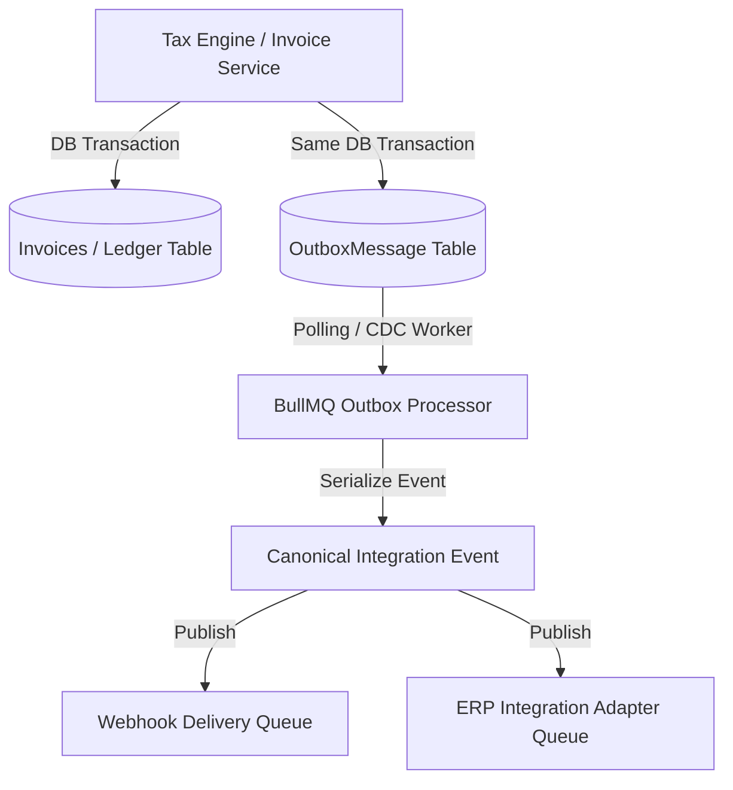

# Stage 15 — Production API Platform & Integration Ecosystem Architecture & Design Specification

> **Branch:** `feature/stage-15-api-integration-platform`  
> **Status:** ARCHITECTURE & DESIGN SPECIFICATION — REFINED (AWAITING APPROVAL)  
> **Stage 14 Baseline:** Frozen in `main` branch awaiting live GSP provider access.

---

## 1. Executive Summary & Foundational Alignment

Stage 15 extends TaxFlow GST SaaS into an enterprise-grade **Public API Platform & ERP Integration Ecosystem**. This architecture enables external ERP systems (Microsoft Dynamics 365, SAP S/4HANA, Tally Prime, custom enterprise applications) to securely interact with TaxFlow for automated GST compliance, E-Invoicing, E-Way Bill management, GSTR reconciliation, and statutory return filings.

### Core Architectural Mandates:
1. **Isolated Development Branch**: Developed exclusively in `feature/stage-15-api-integration-platform`. The Stage 14 release candidate in `main` remains untouched and frozen.
2. **Re-use Existing TaxFlow Core Infrastructure**:
   - **Stage 2**: Tenant isolation & NestJS `TenantContextGuard`
   - **Stage 8**: Immutable `AuditModule` & append-only audit trail
   - **Stage 10**: Commercial `EntitlementsModule` & usage counters (zero parallel metering)
   - **Stage 11**: BullMQ background worker queue, job idempotency, & DLQ architecture
   - **Stage 13**: PostgreSQL Row Level Security (RLS) & AES-256-GCM cryptography module
   - **Stage 14**: `/health/live`, `/health/ready` observability probes & deployment guards
3. **Strict Domain Decoupling**: ERP payload structures and external schemas never pass directly into TaxFlow domain services. All transactions follow `External ERP Payload → Integration Adapter → TaxFlow Canonical Model → Tax Engine`.

---

## 2. Refined Architectural Capabilities (12 Points)

### 2.1 Transactional Outbox Pattern
NestJS `EventEmitter` is prohibited as a durable source of integration events. All domain state changes persist a record to a database-backed `OutboxMessage` table within the **same database transaction** as the business entity update.



### 2.2 Canonical Integration Event Contract
Every integration event follows a strict, versioned JSON envelope schema:

```json
{
  "eventId": "evt_9f8e7d6c5b4a3210",
  "eventType": "taxflow.einvoice.irn_generated",
  "eventVersion": "1.0",
  "tenantId": "11111111-1111-1111-1111-111111111111",
  "aggregateType": "INVOICE",
  "aggregateId": "inv_8f9a2b1c",
  "occurredAt": "2026-10-03T12:45:00.000Z",
  "correlationId": "req_1234567890abcdef",
  "causationId": "job_0987654321fedcba",
  "source": "taxflow-einvoice-service",
  "payload": {
    "invoiceNumber": "INV/2026/001",
    "gstin": "27AABCU9603R1ZN",
    "irn": "3a5b7c8d9e0f1a2b3c4d5e6f7a8b9c0d1e2f3a4b5c6d7e8f9a0b1c2d3e4f5a6b",
    "ackNo": 122010984512,
    "ackDate": "2026-10-03 12:45:00",
    "taxableAmount": 100000.00,
    "totalTaxAmount": 18000.00,
    "status": "GENERATED"
  }
}
```

### 2.3 Event Idempotency & Consumer Deduplication
- **Delivery Guarantee**: At-Least-Once delivery.
- **Deduplication Strategy**: Consumers receive `eventId` in the canonical envelope and `X-TaxFlow-Event-ID` in HTTP headers.
- **Deduplication Boundary**: Unique index on `tenantId` + `eventId` + `consumerId` with a 30-day retention window.

### 2.4 API Key Lifecycle Management
- **Creation**: Public Key ID (`tf_live_...` or `tf_test_...`) + Secret Key (`sk_live_...` shown **ONCE** to developer at creation).
- **Hashing**: Secret keys stored as SHA-256 hashes (`apiKeyHash`). Plaintext secret keys are NEVER saved or logged.
- **Scopes**: OAuth-style granular permissions array (`["invoices:read", "einvoice:write", "gstr:file"]`).
- **Lifecycle States**: `ACTIVE`, `ROTATING`, `REVOKED`, `EXPIRED`.
- **Auditing & Tracking**: `lastUsedAt`, `lastUsedIp`, `createdIp`, and audit log tracking on all key events.

### 2.5 API Idempotency Contract
- **Header**: `Idempotency-Key: <UUIDv4>` required on all POST / PUT / DELETE requests.
- **Uniqueness Boundary**: `tenantId` + `idempotencyKey` + `endpointPath`.
- **Request Fingerprinting**: SHA-256 hash of `HTTP Method` + `Path` + `Request Body JSON`.
- **Payload Mismatch Error**: If an `Idempotency-Key` is re-used with a different request fingerprint, return `409 Conflict` (`IDEMPOTENCY_PAYLOAD_MISMATCH`).
- **Lifecycle States**:
  - `IN_PROGRESS`: Currently processing (returns `409 Conflict` if duplicate concurrent request arrives).
  - `SUCCEEDED`: Returns cached HTTP Status & Response Body.
  - `FAILED`: Processing failed; allows retry with same key.
  - `EXPIRED`: 24-hour TTL expired.

### 2.6 Distributed Rate Limiting & Stage 10 Integration
- **Mechanism**: Redis sliding window / token bucket per `tenantId` and `apiKeyId`.
- **No Duplicate Counters**: Integrates directly with Stage 10 `UsageMeteringService` to deduct monthly API transaction quotas.
- **Headers Exposed**:
  - `X-RateLimit-Limit`: Maximum requests per window (e.g. 1000/min).
  - `X-RateLimit-Remaining`: Remaining requests in active window.
  - `X-RateLimit-Reset`: UTC epoch timestamp when window resets.

### 2.7 Webhook Security & SSRF Hardening
- **SSRF Protection**: Webhook URLs are resolved via strict DNS resolution and blocked against private/internal IP ranges:
  - Loopback (`127.0.0.0/8`, `::1`)
  - Private IPv4 (`10.0.0.0/8`, `172.16.0.0/12`, `192.168.0.0/16`)
  - Link-Local / Cloud Metadata (`169.254.169.254` AWS/GCP IMDS)
- **Transport Security**: HTTPS mandatory (`https://` required). HTTP rejected.
- **Redirect Policy**: Zero redirects allowed (`followRedirects: false`).
- **Limits**: HTTP Timeout fixed at 10,000 ms; max payload size capped at 1 MB.

### 2.8 Webhook Retry Policy & State Machine
- **Signature**: `X-TaxFlow-Signature: t={timestamp},v1={hmac_sha256}`.
- **Replay Protection**: Timestamps > 5 minutes old rejected by receivers.
- **HTTP Response Handling**:
  - **Retryable Errors** (`429`, `502`, `503`, `504`, Connection Timeout): Scheduled for exponential backoff retry.
  - **Permanent Failures** (`400`, `401`, `403`, `404`, `422`): Delivery marked `FAILED` immediately without retry.
  - **Retry Schedule**: Attempt 1 (Immediate), Attempt 2 (+1m), Attempt 3 (+5m), Attempt 4 (+15m), Attempt 5 (+1h).
- **Delivery States**: `PENDING` → `DELIVERED` | `FAILED` → `DEAD_LETTER`.

### 2.9 Credential & Key Management
- **Encryption Algorithm**: AES-256-GCM using Stage 13 `CryptographyService`.
- **Authenticated Additional Data (AAD)**: Encrypted payload bound to `tenantId:credentialId`.
- **Key Rotation**: Supports key versioning (`keyVersion: 1, 2...`) enabling zero-downtime key rotation.
- **Log Hygiene**: Automated log interceptor redacts secrets, keys, and tokens from stdout/stderr.

### 2.10 Integration Health Model
Every external ERP connector and webhook destination maintains an explicit state machine:
- `CONNECTED`: Operational and passing health checks.
- `DEGRADED`: Intermittent 5xx errors or elevated latency (> 3000ms).
- `AUTH_FAILED`: External OAuth token expired / credentials invalid.
- `RATE_LIMITED`: External ERP endpoint returning 429 Too Many Requests.
- `ERROR`: Unhandled structural failure or 500 server response.
- `DISABLED`: Manually disabled by tenant administrator.

### 2.11 ERP Adapter Framework Architecture
ERP-specific logic is strictly isolated outside core domain services.

```text
TaxFlow Core Domain Model
       ▲
       │ (Canonical DTO)
TaxFlow Integration Adapter Boundary
       ▲
┌──────┴───────────────┬──────────────────────┬────────────────┐
│ MS Dynamics 365 BC   │ MS Dynamics 365 F&O │ SAP S/4HANA    │ Tally Prime / XML
└──────────────────────┴──────────────────────┴────────────────┴────────────────
```
- **Microsoft Dynamics 365 Business Central**: Native OData v4 / REST API adapter.
- **Microsoft Dynamics 365 Finance & Operations**: REST / Business Events adapter (dual-write treated as optional extension).
- **SAP S/4HANA / ECC**: SAP OData / REST service adapter for SD & MM modules.
- **Tally Prime**: XML over HTTP / TCP Tally XML gateway.
- **Generic REST / SFTP**: Batch file watcher & webhooks.

### 2.12 Re-use of Existing TaxFlow Infrastructure
Stage 15 strictly builds upon existing core modules without duplication:
- **Tenant Security**: Extends `src/nestjs/common/guards/tenant-context.guard.ts`.
- **Audit Logging**: Uses `src/nestjs/modules/audit/audit.service.ts`.
- **Entitlements**: Uses `src/nestjs/modules/billing/billing.service.ts` and `UsageMeteringService`.
- **Background Queues**: Extends `src/nestjs/modules/jobs/jobs.service.ts` and BullMQ processors.
- **Observability**: Exposes metrics under `src/nestjs/modules/health/health.service.ts`.

---

## 3. Database Impact Assessment (Prisma Schema Additions)

All database schema additions are **strictly additive** and non-destructive. Baseline tables remain untouched.

```prisma
// Proposed New Tables for Stage 15
model ApiKey {
  id           String    @id @default(uuid())
  tenantId     String
  name         String
  keyPrefix    String    // e.g. "tf_live_"
  apiKeyHash   String    @unique // SHA-256 hash of secret key
  environment  String    @default("live") // live | test
  scopes       String[]  // OAuth-style scopes
  rateLimit    Int       @default(1000)
  expiresAt    DateTime?
  lastUsedAt   DateTime?
  lastUsedIp   String?
  status       String    @default("ACTIVE") // ACTIVE | ROTATING | REVOKED | EXPIRED
  createdAt    DateTime  @default(now())
  updatedAt    DateTime  @updatedAt

  @@index([tenantId, keyPrefix])
}

model OutboxMessage {
  id            String    @id @default(uuid())
  tenantId      String
  aggregateType String
  aggregateId   String
  eventType     String
  eventVersion  String    @default("1.0")
  payload       Json
  correlationId String
  status        String    @default("PENDING") // PENDING | PROCESSED | FAILED
  retryCount    Int       @default(0)
  scheduledAt   DateTime  @default(now())
  processedAt   DateTime?
  createdAt     DateTime  @default(now())

  @@index([tenantId, status, scheduledAt])
}

model IdempotencyRecord {
  id             String   @id @default(uuid())
  tenantId       String
  idempotencyKey String
  endpointPath   String
  requestHash    String
  responseStatus Int
  responseBody   Json
  status         String   @default("IN_PROGRESS") // IN_PROGRESS | SUCCEEDED | FAILED
  createdAt      DateTime @default(now())
  expiresAt      DateTime

  @@unique([tenantId, idempotencyKey, endpointPath])
  @@index([expiresAt])
}

model WebhookSubscription {
  id          String   @id @default(uuid())
  tenantId    String
  name        String
  targetUrl   String
  secretKey   String   // Encrypted AES-256-GCM
  events      String[] // Event topics
  status      String   @default("ACTIVE") // ACTIVE | DEGRADED | DISABLED
  createdAt   DateTime @default(now())
  updatedAt   DateTime @updatedAt

  @@index([tenantId, status])
}

model WebhookDeliveryLog {
  id             String    @id @default(uuid())
  tenantId       String
  subscriptionId String
  eventId        String
  eventType      String
  targetUrl      String
  requestHeaders Json
  requestPayload Json
  responseStatus Int?
  responseBody   String?
  durationMs     Int?
  attemptNumber  Int       @default(1)
  status         String    // DELIVERED | FAILED | DEAD_LETTER
  errorMessage   String?
  createdAt      DateTime  @default(now())

  @@index([tenantId, subscriptionId, status])
}
```

---

## 4. Stage 15 Implementation Sequence

Development follows a strict 5-subphase progression:

```
Stage 15.1 — Public API Foundation (API Versioning, Keys, Scopes, Idempotency, Rate Limiting, OpenAPI)
    │
    ▼
Stage 15.2 — Integration Event Foundation (Transactional Outbox, Canonical Envelope, Event Registry)
    │
    ▼
Stage 15.3 — Webhook Platform (Subscriptions, HMAC Signing, Replay Protection, SSRF Guard, DLQ)
    │
    ▼
Stage 15.4 — Developer Portal (Key Management, Swagger UI, Webhook Log Inspector, Postman Collection)
    │
    ▼
Stage 15.5 — ERP Integration Framework (Adapter Interfaces, BC, D365 F&O, SAP, Tally Connectors)
```

---

## 5. Detailed Implementation Plan: Stage 15.1 — API Foundation

### Components to Build:
1. `ApiKeyService` & `ApiKeyController`: Management of API keys, scope verification, and SHA-256 hashing.
2. `ApiKeyAuthGuard`: NestJS guard validating `Authorization: Bearer tf_live_...` against hashed keys.
3. `IdempotencyService` & `IdempotencyInterceptor`: Request fingerprinting, state tracking (`IN_PROGRESS`, `SUCCEEDED`), and payload mismatch rejection (`409 Conflict`).
4. `RateLimiterGuard`: Redis-based sliding window rate limiter integrated with Stage 10 `BillingService`.
5. `OpenApiModule`: OpenAPI 3.0 specification auto-generator exposing `/api/docs`.
6. `ApiExceptionFilter`: RFC 7807 Problem Details exception formatter.

### API Contract Definitions (RFC 7807 Example):
```json
{
  "type": "https://taxflow.ai/errors/idempotency-payload-mismatch",
  "title": "Idempotency Payload Mismatch",
  "status": 409,
  "detail": "Idempotency-Key 'idemp_12345' was previously used with a different request payload fingerprint.",
  "instance": "/api/v1/invoices",
  "code": "IDEMPOTENCY_PAYLOAD_MISMATCH",
  "timestamp": "2026-10-03T12:50:00Z",
  "correlationId": "req_a1b2c3d4e5f6"
}
```

---

## 6. Test Strategy & Security Test Matrix

### Test Methodology (TDD Flow):
`Architecture Spec → API Contracts → Failing Unit Tests → Component Implementation → Integration Tests → Security & IDOR Attack Tests`

### Security Test Matrix for Stage 15.1:
| Test ID | Test Case Title | Attack Vector / Scenario | Expected Outcome |
|---|---|---|---|
| **SEC-15-01** | Invalid API Key Authentication | Malformed or unregistered API key | HTTP 401 Unauthorized |
| **SEC-15-02** | Cross-Tenant API Key Spoofing | Tenant A key used to query Tenant B invoice ID | HTTP 403 Forbidden + RLS SQL Rejection |
| **SEC-15-03** | Scope Violation Enforcement | API Key with `invoices:read` attempts `einvoice:generate` | HTTP 403 Forbidden |
| **SEC-15-04** | Rate Limit Exceeded | 1001st request within 60 seconds | HTTP 429 Too Many Requests + Retry headers |
| **SEC-15-05** | Idempotency Payload Mismatch | Re-using `Idempotency-Key` with modified total amount | HTTP 409 Conflict |
| **SEC-15-06** | Concurrent Idempotent Requests | Two simultaneous POST requests with identical `Idempotency-Key` | One returns HTTP 201/200; second receives HTTP 409 Concurrent |

---

## 7. Stage 15.1 Acceptance Criteria

1. **API Key Management**: Creation, SHA-256 hashing, scope enforcement, and revocation verified.
2. **Idempotency**: `Idempotency-Key` fingerprinting and payload mismatch protection verified.
3. **Rate Limiting**: Sliding window rate-limiting verified in Redis with Stage 10 quota deduction.
4. **RFC 7807 Errors**: All API errors conform to standard RFC 7807 JSON format with correlation IDs.
5. **Security & RLS**: Zero cross-tenant data leakage across all API endpoints.
6. **Automated Verification**: `npx tsx src/nestjs/tests/stage-15-1-api-foundation.spec.ts` passes 100%.

---

## 8. Critical Stage 14 Preemption Guard

If live production GSP credentials arrive at any point during Stage 15 work:
1. **Immediately pause** all Stage 15 development activities.
2. **Switch to Stage 14 verification**: Run live GSP certification gates (`TEST-01`, `TEST-03`, `TEST-04`, `TEST-05`, Fail-Closed Guard).
3. **No Baseline Pollution**: Stage 14 files in `main` branch remain completely pristine and unaffected.

---

## 9. Stage 15.5.1 — Integration Adapter Framework Architecture

### 9.1 Target Architecture & Separation of Concerns
The TaxFlow core domain services are completely decoupled from external ERP provider logic:

`TaxFlow Core Domain → Canonical DTO Models → ERP Adapter Interface → Provider Connector → External ERP`

- **Core Domain Protection**: Zero provider-specific DTOs, endpoint URLs, or vendor headers exist inside core tax/invoice services.
- **Canonical Translation**: All data exchanges pass through `CanonicalERPInvoiceDto` envelopes.

### 9.2 Standard Adapter Contract Interface
Every ERP connector must implement the standard `IntegrationAdapter` contract:
- `connect(config: any): Promise<boolean>`: Initializes connection and validates credentials.
- `disconnect(connectionId: string): Promise<boolean>`: Safely releases resources.
- `testConnection(config: any): Promise<{ success: boolean; latencyMs: number; message?: string }>`: Performs live ping/auth test.
- `getCapabilities(): ERPAdapterCapabilities`: Returns explicit capability discovery matrix.
- `push(payload: CanonicalERPInvoiceDto): Promise<ERPAdapterSyncResult>`: Pushes single canonical record to external ERP.
- `pull(query: ERPAdapterPullQueryDto): Promise<CanonicalERPInvoiceDto[]>`: Fetches records from ERP.
- `sync(batch: CanonicalERPInvoiceDto[]): Promise<ERPAdapterBatchResult>`: Synchronizes a batch of canonical records with partial failure handling.
- `healthCheck(): Promise<{ status: 'HEALTHY' | 'DEGRADED' | 'UNHEALTHY'; details?: any }>`: Executes runtime health check.

### 9.3 Capability Discovery Matrix
Explicit feature flags prevent invoking unsupported operations:
- `supportsInbound: boolean`
- `supportsOutbound: boolean`
- `supportsRealtimePush: boolean`
- `supportsBatchSync: boolean`
- `supportsWebhookTriggers: boolean`
- `supportedEntities: Array<'INVOICE' | 'CREDIT_NOTE' | 'DEBIT_NOTE' | 'EWAYBILL' | 'GSTR2B'>`

### 9.4 Provider Error Normalization (RFC 7807)
Provider-specific HTTP/API failures are normalized into `ERPProviderException`:
- `errorCode`: Normalized code (`ERP_AUTH_FAILED`, `ERP_RATE_LIMITED`, `ERP_TIMEOUT`, `ERP_SERVER_ERROR`, `ERP_RECORD_EXISTS`).
- `providerStatus`: Raw external status code (e.g. `401`, `429`, `500`, `504`).
- `isRetryable`: Boolean flag (`true` for `429`/`5xx`/timeouts like `504 Gateway Timeout` mapped to `ERP_SERVER_ERROR`/`ERP_TIMEOUT`, `false` for `401`/`403`/`400`).
- `correlationId`: Tracing identifier.

### 9.5 Prisma Schema & Database Impact
Added `ErpConnection` model to `prisma/schema.prisma` tracking:
- `tenantId`, `provider`, `name`, `status` (`CONNECTED` | `DISCONNECTED` | `DEGRADED` | `ERROR`)
- `targetUrl` (SSRF protected)
- `encryptedConfig` (AES-256-GCM encrypted at rest using Stage 13 `CryptographyService` with AAD `tenantId`)
- `lastHealthCheckAt`, `lastSyncAt`

### 9.6 Security Model
- **Tenant Isolation**: Mandatory `tenantId` parameter on all registry and connection operations.
- **Credential Storage**: AES-256-GCM encryption at rest with zero plain-text logging.
- **SSRF Protection**: Hostname resolution and private IP blocking for all user-configurable ERP endpoints.
- **Audit Logging**: Every connection lifecycle change, test attempt, and batch sync logs immutable audit events.

---

## 10. Stage 15.5.4 — Microsoft Dynamics 365 Business Central Connector Architecture

### 10.1 Target Integration Flow
The Business Central connector acts as an isolated translation layer between TaxFlow's canonical model and Microsoft Dynamics 365 Business Central REST/OData API v2.0:

`TaxFlow Canonical Model → Dynamics365BcAdapter → OData v4 / REST API v2.0 → Dynamics 365 Business Central`

- **Core Isolation**: The core domain model (`CanonicalERPInvoiceDto`) remains untouched.
- **Vendor Mapping Boundary**: BC-specific fields (`externalDocumentNumber`, `customerNumber`, `salesInvoiceLines`) are constructed within `Dynamics365BcAdapter`.

### 10.2 Authentication & Environment Strategy
- **OAuth2 OAuth Strategy**: Microsoft Entra ID (Azure AD) Client Credentials flow (`https://login.microsoftonline.com/{azureTenantId}/oauth2/v2.0/token`).
- **Scope**: `https://api.businesscentral.dynamics.com/.default`.
- **Target Company Selection**: Operations target a specific Business Central Company GUID:
  `https://api.businesscentral.dynamics.com/v2.0/{azureTenantId}/{environment}/api/v2.0/companies({companyId})/salesInvoices`.

### 10.3 Entity Mappings
| TaxFlow Canonical DTO Field | Dynamics 365 BC Field | Target Endpoint |
|---|---|---|
| `invoiceNumber` | `externalDocumentNumber` & `number` | `salesInvoices` |
| `invoiceDate` | `postingDate` / `documentDate` | `salesInvoices` |
| `buyerGstin` / `buyerName` | `customerNumber` & `customerName` | `salesInvoices` |
| `taxableValue` / `totalValue` | `totalAmountExcludingTax` / `totalAmountIncludingTax` | `salesInvoices` |
| `items` | `salesInvoiceLines` | `salesInvoices({id})/salesInvoiceLines` |
| `irn` & `ewayBillNumber` | `customFields` / `shortcutDimension` | `salesInvoices` |

### 10.4 Error Normalization & Retry Policy
- `HTTP 401 / 403`: Mapped to `ERPProviderException` (`code: 'ERP_AUTH_FAILED'`, `isRetryable: false`).
- `HTTP 409`: Mapped to `DUPLICATE_RECORD` status (`externalDocumentNumber` collision).
- `HTTP 429`: Mapped to `ERPProviderException` (`code: 'ERP_RATE_LIMITED'`, `isRetryable: true`, parses `Retry-After`).
- `HTTP 500 / 503 / 504`: Mapped to `ERPProviderException` (`code: 'ERP_SERVER_ERROR'`, `isRetryable: true`).

---

## 11. Stage 15.5.5 — Microsoft Dynamics 365 Finance & Operations Connector Architecture

### 11.1 Target Integration Flow
The Finance & Operations connector acts as an isolated translation layer between TaxFlow's canonical model and Microsoft Dynamics 365 F&O OData Data Entities & Business Events APIs:

`TaxFlow Canonical Model → Dynamics365FoAdapter → F&O Data Entities (SalesOrderHeadersV2) → Dynamics 365 F&O`

- **Core Isolation**: The core domain model (`CanonicalERPInvoiceDto`) remains untouched.
- **Vendor Mapping Boundary**: F&O-specific fields (`CustomerInvoiceNumber`, `dataAreaId`, `SalesOrderLinesV2`) are constructed within `Dynamics365FoAdapter`.

### 11.2 Authentication & Legal Entity Strategy
- **OAuth2 OAuth Strategy**: Microsoft Entra ID (Azure AD) Client Credentials flow (`https://login.microsoftonline.com/{azureTenantId}/oauth2/v2.0/token`).
- **Resource Scope**: `{environmentUrl}` (e.g., `https://{instance}.operations.dynamics.com`).
- **Legal Entity (`dataAreaId`) Targeting**: Operations explicitly specify F&O `dataAreaId` (Legal Entity e.g., `'USMF'`, `'IN01'`):
  `https://{instance}.operations.dynamics.com/data/SalesOrderHeadersV2?cross-company=true`.

### 11.3 Entity Mappings
| TaxFlow Canonical DTO Field | Dynamics 365 F&O Data Entity Field | Target Endpoint |
|---|---|---|
| `invoiceNumber` | `CustomerInvoiceNumber` / `SalesOrderNumber` | `SalesOrderHeadersV2` |
| `invoiceDate` | `InvoiceDate` / `SalesOrderDate` | `SalesOrderHeadersV2` |
| `buyerGstin` / `buyerName` | `OrderingCustomerAccountNumber` & `InvoiceCustomerName` | `SalesOrderHeadersV2` |
| `taxableValue` / `totalValue` | `TotalTaxableAmount` / `TotalInvoiceAmount` | `SalesOrderHeadersV2` |
| `items` | `SalesOrderLinesV2` | `SalesOrderHeadersV2(HeaderNumber)/SalesOrderLinesV2` |
| `irn` & `ewayBillNumber` | `GSTIN_IRN` & `GSTIN_EWayBill` | `SalesOrderHeadersV2` |

### 11.4 Integration Capabilities & Event Strategy
- **Primary Data Entities**: OData v4 REST API (`/data/SalesOrderHeadersV2`, `/data/SalesOrderLinesV2`).
- **Business Events**: Webhook triggers for real-time invoice posting and reconciliation events.
- **Dual-write Extension**: Optional extension point supported via data entity layer (not mandatory).

### 11.5 Error Normalization & Retry Policy
- `HTTP 401 / 403`: Mapped to `ERPProviderException` (`code: 'ERP_AUTH_FAILED'`, `isRetryable: false`).
- `HTTP 409`: Mapped to `DUPLICATE_RECORD` status (`CustomerInvoiceNumber` collision).
- `HTTP 429`: Mapped to `ERPProviderException` (`code: 'ERP_RATE_LIMITED'`, `isRetryable: true`, parses `Retry-After`).
- `HTTP 500 / 503 / 504`: Mapped to `ERPProviderException` (`code: 'ERP_SERVER_ERROR'`, `isRetryable: true`).

---

## 12. Stage 15.5.6 — SAP S/4HANA / ECC Connector Architecture

### 12.1 Target Integration Flow
The SAP adapter acts as a capability-driven translation layer between TaxFlow's canonical model and SAP S/4HANA or ECC integration interfaces:

`TaxFlow Canonical Model → SapAdapter → SAP Integration Layer (OData / BAPI / IDoc) → SAP S/4HANA / ECC`

- **Core Isolation**: The core domain model (`CanonicalERPInvoiceDto`) remains untouched.
- **Vendor Mapping Boundary**: SAP-specific structures (`XBLNR`, `BUKRS`, `KUNNR`, `ACCOUNTGL`, `to_Item`) are constructed strictly inside `SapAdapter`.

### 12.2 Authentication & Connection Strategy
- **Supported Integration Protocols**:
  - `ODATA`: Native OData v2/v4 REST services (`/sap/opu/odata/sap/API_SALES_ORDER_SRV`).
  - `BAPI`: BAPI/RFC XML endpoints (`BAPI_ACC_DOCUMENT_POST`, `BAPI_INCOMINGINVOICE_CREATE`).
  - `IDOC`: Asynchronous IDoc XML endpoints (`ACC_INVOICE_REC`, `INVOIC02`).
- **Supported Authentication Schemes**: OAuth2 Client Credentials, Basic Authentication (`Username`/`Password`), API Key header (`APIKey`), or SAP Cloud Connector mutual TLS.
- **Target Organizational Units**: Configurable SAP parameters:
  - `companyCode` (`BUKRS` e.g., `'1000'`)
  - `salesOrg` (`VKORG` e.g., `'1000'`)
  - `plant` (`WERKS` e.g., `'1010'`)

### 12.3 Capability Matrix & Protocol Strategy
- `sapSystemType`: `'S4HANA'` or `'ECC'`.
- Capability flags adapt dynamically based on protocol configuration without creating customer-specific code branches.

### 12.4 Entity Mappings
| TaxFlow Canonical DTO Field | SAP Field / Parameter | Target OData / BAPI Entity |
|---|---|---|
| `invoiceNumber` | `XBLNR` (Reference Document Number) | `Header.XBLNR` / `PurchaseOrderByCustomer` |
| `invoiceDate` | `BLDAT` / `DocumentDate` | `Header.BLDAT` / `SalesOrderDate` |
| `buyerGstin` / `buyerName` | `KUNNR` / `SoldToParty` & `Name1` | `Header.KUNNR` / `SoldToParty` |
| `companyCode` | `BUKRS` / `CompanyCode` | `Header.BUKRS` |
| `taxableValue` / `totalValue` | `WRBTR` / `TotalNetAmount` | `Header.WRBTR` / `TotalAmount` |
| `items` | `ACCOUNTGL` / `to_Item` | `Items.to_Item` / `LineItems` |
| `irn` & `ewayBillNumber` | `HEADER_TEXT` / `BKTXT` | `Header.BKTXT` |

### 12.5 Error Normalization & Retry Policy
- `HTTP 401 / 403`: Mapped to `ERPProviderException` (`code: 'ERP_AUTH_FAILED'`, `isRetryable: false`).
- `HTTP 409` or SAP `XBLNR` Duplicate Warning: Mapped to `DUPLICATE_RECORD` status.
- `HTTP 429`: Mapped to `ERPProviderException` (`code: 'ERP_RATE_LIMITED'`, `isRetryable: true`, parses `Retry-After`).
- `HTTP 500 / 503 / 504`: Mapped to `ERPProviderException` (`code: 'ERP_SERVER_ERROR'`, `isRetryable: true`).

---

## 13. Stage 15.5.7 — Tally Prime Connector Architecture

### 13.1 Target Integration Flow
The Tally Prime adapter acts as an isolated XML envelope translation layer between TaxFlow's canonical model and Tally Prime XML HTTP Interface:

`TaxFlow Canonical Model → TallyPrimeAdapter → Tally XML / HTTP Gateway → Tally Prime`

- **Core Isolation**: The core domain model (`CanonicalERPInvoiceDto`) remains untouched.
- **Vendor Mapping Boundary**: Tally-specific XML tags (`<VOUCHER>`, `<PARTYLEDGERNAME>`, `<ALLINVENTORYENTRIES.LIST>`, `<ALLLEDGERENTRIES.LIST>`) are constructed strictly inside `TallyPrimeAdapter`.

### 13.2 Connection & Company Targeting Strategy
- **Integration Mechanism**: Tally XML over HTTP (`http://{host}:{port}` e.g., `http://localhost:9000` or remote Tally.Server 9 endpoint).
- **Target Company Selection**: Requests target specific Tally Company via `<SVCURRENTCOMPANY>` tag or XML Header:
  - `<HEADER><TALLYREQUEST>Import Data</TALLYREQUEST><SVCURRENTCOMPANY>Demo Company Pvt Ltd</SVCURRENTCOMPANY></HEADER>`
- **Authentication**: Optional Basic Authentication, Tally Vault Credentials header, or API Token.
- **SSRF Protection**: All user-configured Tally URLs validate hostnames and guard against internal network scanning.

### 13.3 XML Envelope Abstraction & Entity Mapping
| TaxFlow Canonical DTO Field | Tally XML Tag / Element | Target Tally Structure |
|---|---|---|
| `invoiceNumber` | `<VOUCHERNUMBER>` & `<REFERENCE>` | `<VOUCHER Action="Create" VCHTYPE="Sales">` |
| `invoiceDate` | `<DATE>` (Format: `YYYYMMDD`) | `<VOUCHER>` Header |
| `buyerName` | `<PARTYLEDGERNAME>` | `<VOUCHER>` Header |
| `buyerGstin` | `<PARTYGSTIN>` | `<VOUCHER>` Header / Party Ledger |
| `taxableValue` | `<AMOUNT>` (Negative for Sales Ledger) | `<ALLLEDGERENTRIES.LIST>` |
| `cgstTotal`, `sgstTotal`, `igstTotal` | `<AMOUNT>` | `<ALLLEDGERENTRIES.LIST>` (CGST/SGST/IGST Ledgers) |
| `items` | `<ALLINVENTORYENTRIES.LIST>` | `<STOCKITEMNAME>`, `<ACTUALQTY>`, `<RATE>`, `<AMOUNT>`, `<GSTHSNCODE>` |
| `irn` & `ewayBillNumber` | `<IRN>` & `<EWAYBILLNUMBER>` | Custom UDF / Voucher Extension Tags |

### 13.4 Response Parsing & Idempotency
- Parses Tally XML response envelope:
  - `<RESPONSE><CREATED>1</CREATED><ALTERED>0</ALTERED><ERRORS>0</ERRORS></RESPONSE>` $\to$ `POSTED`
  - `<LINEERROR>` or `Duplicate Voucher` string $\to$ `DUPLICATE_RECORD`
- Idempotency key checked against existing `VOUCHERNUMBER` and `REFERENCE`.

### 13.5 Error Normalization & Retry Policy
- `HTTP 401 / 403` or Tally Auth Failure: Mapped to `ERPProviderException` (`code: 'ERP_AUTH_FAILED'`, `isRetryable: false`).
- Tally `<LINEERROR>` / XML Validation Error: Mapped to `ERPProviderException` (`code: 'ERP_VALIDATION_ERROR'`, `isRetryable: false`).
- `HTTP 429` / Server Busy: Mapped to `ERPProviderException` (`code: 'ERP_RATE_LIMITED'`, `isRetryable: true`).
- Network Refused / `HTTP 500 / 504`: Mapped to `ERPProviderException` (`code: 'ERP_SERVER_ERROR'`, `isRetryable: true`).

---

## 14. Stage 15.5.8 — Zoho Books Connector Architecture

### 14.1 Target Integration Flow
The Zoho Books adapter acts as an isolated REST translation layer between TaxFlow's canonical model and Zoho Books API v3:

`TaxFlow Canonical Model → ZohoBooksAdapter → Zoho Books REST API v3 → Zoho Books`

- **Core Isolation**: The core domain model (`CanonicalERPInvoiceDto`) remains untouched.
- **Vendor Mapping Boundary**: Zoho-specific fields (`invoice_number`, `customer_id`, `gst_treatment`, `hsn_or_sac`, `line_items`) are constructed strictly inside `ZohoBooksAdapter`.

### 14.2 Authentication, Token Lifecycle & Multi-Region Strategy
- **OAuth2 Token Lifecycle**:
  - Uses Refresh Token grant flow (`https://accounts.zoho.{region}/oauth/v2/token?refresh_token=...&client_id=...&client_secret=...&grant_type=refresh_token`).
  - Automatically handles expired access tokens by requesting fresh short-lived access tokens.
- **Multi-Region Support**: Configurable data center TLDs:
  - `.in` (India e.g. `https://books.zoho.in`)
  - `.com` (US / Global e.g. `https://books.zoho.com`)
  - `.eu` (Europe e.g. `https://books.zoho.eu`)
  - `.com.au` (Australia e.g. `https://books.zoho.com.au`)
  - `.ca` (Canada e.g. `https://books.zoho.ca`)

### 14.3 Organization Selection & Tenant Isolation
- **Organization Targeting**: Every API call includes the mandatory `organization_id` header or query parameter (`organization_id=789012345`).
- **Tenant Isolation Guard**: Verified zero cross-tenant organization ID leakage.

### 14.4 Entity Mappings
| TaxFlow Canonical DTO Field | Zoho Books API Field | Target REST Endpoint |
|---|---|---|
| `invoiceNumber` | `invoice_number` | `POST /api/v3/invoices?organization_id={orgId}` |
| `invoiceDate` | `date` (`YYYY-MM-DD`) | `POST /api/v3/invoices` |
| `buyerName` / `buyerGstin` | `customer_name` & `gst_no` | `POST /api/v3/invoices` |
| `taxableValue` / `totalValue` | `sub_total` / `total` | `POST /api/v3/invoices` |
| `items` | `line_items` array (`name`, `rate`, `quantity`, `hsn_or_sac`) | `POST /api/v3/invoices` |
| `irn` & `ewayBillNumber` | `custom_fields` / `einvoice_details` | `POST /api/v3/invoices` |

### 14.5 Error Normalization & Retry Policy
- `HTTP 401 / 403` or Zoho Code `57` / `1002` (Invalid OAuth Token): Mapped to `ERPProviderException` (`code: 'ERP_AUTH_FAILED'`, `isRetryable: false`).
- `HTTP 409` or Zoho Code `100005` (Duplicate Invoice Number): Mapped to `DUPLICATE_RECORD` status.
- `HTTP 429`: Mapped to `ERPProviderException` (`code: 'ERP_RATE_LIMITED'`, `isRetryable: true`, parses `Retry-After`).
- `HTTP 500 / 502 / 503 / 504`: Mapped to `ERPProviderException` (`code: 'ERP_SERVER_ERROR'`, `isRetryable: true`).

---

## 15. Stage 15.5.9 — Oracle Fusion ERP Connector Architecture

### 15.1 Target Integration Flow
The Oracle Fusion adapter acts as an isolated REST translation layer between TaxFlow's canonical model and Oracle Fusion FSCM REST Services:

`TaxFlow Canonical Model → OracleFusionAdapter → Oracle Fusion FSCM REST API → Oracle Fusion ERP Cloud`

- **Core Isolation**: The core domain model (`CanonicalERPInvoiceDto`) remains untouched.
- **Vendor Mapping Boundary**: Oracle-specific fields (`TransactionNumber`, `BusinessUnit`, `BillToCustomerName`, `receivablesInvoiceLines`) are constructed strictly inside `OracleFusionAdapter`.

### 15.2 Authentication, Base URL & Business Unit Strategy
- **OAuth2 / Credentials Strategy**:
  - OAuth2 Client Credentials Grant (`https://{instance}.fa.oraclecloud.com/oauth2/v1/token`) or HTTP Basic Authentication.
- **Environment Base URL**: `environmentUrl` (e.g. `https://fa-instance.oraclecloud.com`).
- **Business Unit (`BusinessUnit`) Targeting**: Every request explicitly targets a configured Oracle Business Unit (e.g. `'US1 Business Unit'`, `'IN Business Unit'`).
- **SSRF Guard**: Resolves and validates Oracle Cloud hostnames against SSRF restrictions.

### 15.3 Entity Mappings
| TaxFlow Canonical DTO Field | Oracle Fusion Field | Target Oracle REST Resource |
|---|---|---|
| `invoiceNumber` | `TransactionNumber` | `POST /fscmRestApi/resources/11.13.18.05/receivablesInvoices` |
| `invoiceDate` | `TransactionDate` | `POST /fscmRestApi/resources/11.13.18.05/receivablesInvoices` |
| `buyerName` / `buyerGstin` | `BillToCustomerName` & `TaxRegistrationNumber` | `POST /fscmRestApi/resources/11.13.18.05/receivablesInvoices` |
| `taxableValue` / `totalValue` | `TotalAmount` / `InvoiceAmount` | `POST /fscmRestApi/resources/11.13.18.05/receivablesInvoices` |
| `items` | `receivablesInvoiceLines` array (`LineNumber`, `Description`, `Quantity`, `UnitPrice`, `Amount`, `HSNCode`) | `POST /fscmRestApi/resources/11.13.18.05/receivablesInvoices` |
| `irn` & `ewayBillNumber` | `FlexfieldAttributes` / `AttributeCategory` | `POST /fscmRestApi/resources/11.13.18.05/receivablesInvoices` |

### 15.4 Pagination & Response Handling
- Supports standard Oracle FSCM REST pagination parameters (`limit`, `offset`, `hasMore`).
- Parses JSON responses returning `CustomerTransactionId` or `TransactionNumber`.

### 15.5 Error Normalization & Retry Policy
- `HTTP 401 / 403`: Mapped to `ERPProviderException` (`code: 'ERP_AUTH_FAILED'`, `isRetryable: false`).
- `HTTP 409` or Oracle Duplicate `TransactionNumber` error: Mapped to `DUPLICATE_RECORD` status.
- `HTTP 429`: Mapped to `ERPProviderException` (`code: 'ERP_RATE_LIMITED'`, `isRetryable: true`, parses `Retry-After`).
- `HTTP 500 / 502 / 503 / 504`: Mapped to `ERPProviderException` (`code: 'ERP_SERVER_ERROR'`, `isRetryable: true`).


