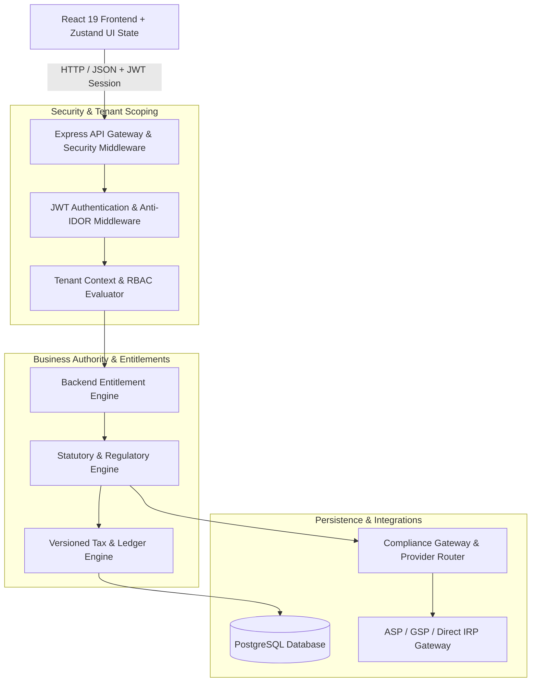
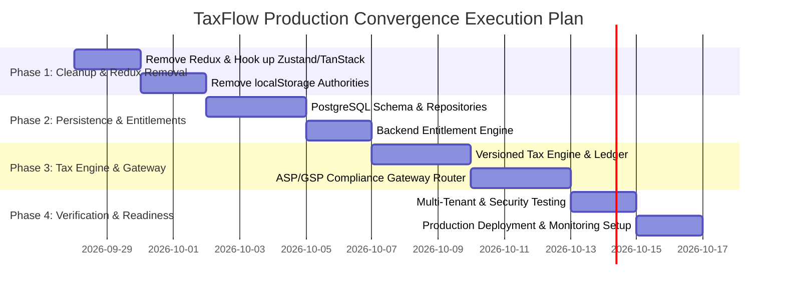

# TaxFlow Production Convergence Map

> **Status:** Architecture Frozen  
> **Goal:** Transition TaxFlow from a hybrid client-authoritative frontend/demo codebase into a fully backend-authoritative, multi-tenant, production-grade GST compliance & SaaS platform.

---

## 1. Executive Principles & Architectural Directives

1. **Architecture Freeze**: No further structural redesigns. Focus entirely on implementation convergence, backend authority, persistence, and production readiness.
2. **Backend Authority**: Frontend must never calculate tax, determine GST applicability, enforce plan limits in isolation, or maintain financial/regulatory truth in `localStorage`/`sessionStorage`.
3. **Regulatory Applicability vs. Commercial Entitlement**: Statutory compliance rules (e.g., E-Invoicing applicability based on aggregate turnover thresholds) are distinct from commercial subscription capabilities. Both must be evaluated independently by the backend.
4. **Zero Fake Production Behavior**: Eliminate all `Math.random()` IRN/ACK/EWB generators, mock GSP adapters, simulated sandbox responses in production paths, and hardcoded tenant seeds.
5. **State Management Unification**: Complete the migration away from Redux. Server state belongs exclusively to **TanStack Query**; UI/local state belongs exclusively to **Zustand**.

---

## 2. Module Classification Index

| Module / Component | Classification | Current State | Target State |
| :--- | :--- | :--- | :--- |
| **Backend Core Server (`server.ts`)** | `REFACTOR` | Monolithic express server containing mock data generators, inline router logic, and memory stores. | Modular Express / Node backend using persistent PostgreSQL via repository pattern, scoped middlewares, and ASP/GSP router adapters. |
| **Entitlements & Plans (`src/core/entitlements/`)** | `REFACTOR` | Mixed localStorage persistence + server limits; frontend-customizable catalog. | Strict backend DB-backed Entitlements & Subscription Engine (`Tenant` → `Subscription` → `Plan` → `Entitlements` → `Usage Limits`). |
| **Multi-Tenancy & Auth (`src/core/tenancy/`, `middleware/`)** | `REFACTOR` | Client-controlled headers (`x-tenant-id`) with fallback seeded state. | Backend JWT session-driven tenant extraction, database-level row isolation, and anti-IDOR validation on every route. |
| **Redux Store (`store/store.ts`, `slices/`)** | `REMOVE` | Redux toolkit managing auth, org, tenant, and invoice states alongside Zustand. | Completely removed. Replaced by Zustand (`useAuthStore`, `useOrgStore`) and TanStack Query (`useQuery`, `useMutation`). |
| **LocalStorage Authorities (`utils/safeStorage.ts`, `usageService.ts`)** | `REMOVE` | Stores subscriptions, document vault, tax profiles, and search histories in browser storage. | Removed from production logic paths. Browser storage used only for non-sensitive UI preferences (e.g., collapsed sidebar, theme). |
| **Tax Engine & Regulatory Rules (`src/modules/tax-engine/`)** | `CREATE` / `REFACTOR` | Frontend-side tax calculations and rate lookups. | Backend-authoritative, effective-dated & versioned Tax Engine handling POS, CGST/SGST/IGST, CESS, RCM, Rule 42/43, and Tax Ledger updates. |
| **E-Invoice Gateway (`src/modules/e-invoice/`, `services/gsp/`)** | `REPLACE` | `ProductionGSPProvider` returning fake IRNs, static QR codes, and mocked payload signatures. | Production-grade `ASP/GSP Adapter` & `Canonical E-Invoice DTO` routed through `Compliance Gateway` with real GSP/IRP OAuth, retry queues, and event streams. |
| **E-Way Bill Module (`src/modules/e-way-bill/`)** | `REFACTOR` | UI components calling mock EWB generation logic. | Backend API consumer integrating canonical E-Way Bill generation via Provider Router. |
| **Reconciliation Engine (`src/modules/reconciliation/`)** | `REFACTOR` | In-memory 2B vs Purchase Register matching with auto-save to browser storage. | Database-backed multi-tenant reconciliation service supporting high-volume invoice matching, tolerance configuration, and period locking. |
| **SuperAdmin & Billing Center (`pages/SuperAdminDashboardPage.tsx`)** | `REFACTOR` | Modifies client-side plan schemas and localStorage state directly. | Secure super-admin endpoints updating backend PostgreSQL tenant subscription records and audit trails. |
| **UI Components (`components/`, `pages/`)** | `KEEP` | Rich, responsive React 19 visual interface and workspace layouts. | Retained as-is visually, but updated to consume TanStack Query hooks connected to backend authority endpoints. |

---

## 3. Detailed Technical Architecture & Target State



---

## 4. Layer-by-Layer Migration Specification

### A. Subscription & Entitlement Architecture

```text
Tenant
 ↓
Subscription (Active Status, Billing Cycle, Effective Dates)
 ↓
Plan (Starter/SME, Business/MSME, Professional, Enterprise, Enterprise Plus)
 ↓
Entitlements (Feature Flags, Enabled Modules)
 ↓
Usage Limits (GSTINs, Branches, Users, Monthly Invoices, E-Invoices, API Calls, Storage)
```

* **Database Table Schema**: `tenants`, `plans`, `subscriptions`, `tenant_entitlements`, `usage_ledger`.
* **Enforcement Point**: Backend Express middleware (`enforceEntitlement('e_invoice')` and `checkUsageLimit('monthly_invoices')`).
* **Frontend Responsibility**: Consumes `GET /api/v1/tenant/entitlements` result via TanStack Query to conditionally render UI controls and usage status banners.

### B. Separation of Compliance Applicability vs. Commercial Entitlement

```text
Incoming Transaction Request (e.g. Invoice Creation)
        ↓
1. Statutory / Regulatory Applicability Engine
   - Is E-Invoicing statutorily required? (Aggregate Turnover >= ₹5 Cr, B2B/Exports)
   - Is RCM statutorily applicable? (Notification 13/2017)
   - Is E-Way Bill statutorily mandatory? (Consignment Value > ₹50,000)
        ↓
2. Tenant Subscription Entitlement Engine
   - Does tenant subscription include 'e_invoice_generation' feature?
   - Has tenant reached monthly e-invoice quota limit?
        ↓
3. Execution & Ledger Posting
```

### C. Redux Removal & State Unification

1. **Remove Packages**: Uninstall `@reduxjs/toolkit` and `react-redux`.
2. **Remove Store Files**: Delete `store/store.ts`, `store/slices/*`.
3. **Refactor Selectors**:
   * Replace `useSelector((state: RootState) => state.auth.user)` with `useAuthStore((state) => state.user)`.
   * Replace `useSelector((state: RootState) => state.org)` with `useOrgStore()`.
   * Replace Redux dispatch calls (`dispatch(setSelectedGstin(...))`) with Zustand store setters.
4. **Remove Provider**: Delete `<Provider store={store}>` wrapper from [`src/app/providers.tsx`](file:///c:/Users/Fayas/Downloads/Dev/Projects/taxflow---gst-compliance-saas/src/app/providers.tsx).

### D. Real E-Invoice & Compliance Gateway

1. **Canonical DTO**: Define strictly typed JSON schemas for e-invoice payload generation compliant with GST IRP Schema v1.04.
2. **Provider Router**: Implement dynamic routing between GSPs (e.g., ClearTax, Tera Software, Cygnet, or Direct NIC IRP).
3. **Idempotency & Resilience**:
   * Database table `einvoice_transactions` storing payload hash, request timestamp, retry count, status (`PENDING`, `SUBMITTED`, `SUCCESS`, `FAILED`), and response payload.
   * Exponential backoff retry queue for transient network failures.
   * Zero `Math.random()` or hardcoded mock IRNs in production paths.

---

## 5. Database Schema & Migration Requirements (PostgreSQL)

```sql
-- 1. Tenants & Subscriptions
CREATE TABLE IF NOT EXISTS tenants (
    id VARCHAR(64) PRIMARY KEY,
    name VARCHAR(255) NOT NULL,
    slug VARCHAR(255) UNIQUE NOT NULL,
    created_at TIMESTAMP WITH TIME ZONE DEFAULT CURRENT_TIMESTAMP,
    updated_at TIMESTAMP WITH TIME ZONE DEFAULT CURRENT_TIMESTAMP
);

CREATE TABLE IF NOT EXISTS plans (
    id VARCHAR(64) PRIMARY KEY,
    name VARCHAR(100) NOT NULL,
    code VARCHAR(50) UNIQUE NOT NULL, -- starter_sme, business_msme, professional, enterprise, enterprise_plus
    max_gstins INT NOT NULL DEFAULT 1,
    max_branches INT NOT NULL DEFAULT 1,
    max_users INT NOT NULL DEFAULT 2,
    max_monthly_invoices INT NOT NULL DEFAULT 100,
    max_monthly_einvoices INT NOT NULL DEFAULT 0,
    storage_gb DECIMAL(10,2) NOT NULL DEFAULT 1.00,
    created_at TIMESTAMP WITH TIME ZONE DEFAULT CURRENT_TIMESTAMP
);

CREATE TABLE IF NOT EXISTS tenant_subscriptions (
    id VARCHAR(64) PRIMARY KEY,
    tenant_id VARCHAR(64) REFERENCES tenants(id) ON DELETE CASCADE,
    plan_id VARCHAR(64) REFERENCES plans(id),
    status VARCHAR(50) NOT NULL, -- active, past_due, canceled, trialing
    current_period_start TIMESTAMP WITH TIME ZONE NOT NULL,
    current_period_end TIMESTAMP WITH TIME ZONE NOT NULL,
    created_at TIMESTAMP WITH TIME ZONE DEFAULT CURRENT_TIMESTAMP
);

-- 2. Versioned Tax Rules & Regulatory Core
CREATE TABLE IF NOT EXISTS tax_rules (
    id VARCHAR(64) PRIMARY KEY,
    hsn_sac_code VARCHAR(20) NOT NULL,
    tax_rate DECIMAL(5,2) NOT NULL,
    cgst_rate DECIMAL(5,2) NOT NULL,
    sgst_rate DECIMAL(5,2) NOT NULL,
    igst_rate DECIMAL(5,2) NOT NULL,
    cess_rate DECIMAL(5,2) DEFAULT 0.00,
    effective_from DATE NOT NULL,
    effective_to DATE,
    created_at TIMESTAMP WITH TIME ZONE DEFAULT CURRENT_TIMESTAMP
);

-- 3. Tax Ledger & Multi-Tenant Invoices
CREATE TABLE IF NOT EXISTS invoices (
    id VARCHAR(64) PRIMARY KEY,
    tenant_id VARCHAR(64) NOT NULL REFERENCES tenants(id),
    gstin VARCHAR(15) NOT NULL,
    branch_id VARCHAR(64) NOT NULL,
    invoice_number VARCHAR(100) NOT NULL,
    invoice_date DATE NOT NULL,
    customer_gstin VARCHAR(15),
    taxable_value DECIMAL(14,2) NOT NULL,
    cgst_amount DECIMAL(14,2) NOT NULL,
    sgst_amount DECIMAL(14,2) NOT NULL,
    igst_amount DECIMAL(14,2) NOT NULL,
    cess_amount DECIMAL(14,2) DEFAULT 0.00,
    total_amount DECIMAL(14,2) NOT NULL,
    irn VARCHAR(64),
    irn_status VARCHAR(50) DEFAULT 'PENDING',
    created_at TIMESTAMP WITH TIME ZONE DEFAULT CURRENT_TIMESTAMP,
    CONSTRAINT idx_tenant_invoice UNIQUE (tenant_id, invoice_number)
);

-- 4. Audit Trail
CREATE TABLE IF NOT EXISTS audit_logs (
    id VARCHAR(64) PRIMARY KEY,
    tenant_id VARCHAR(64) NOT NULL,
    user_id VARCHAR(64) NOT NULL,
    action VARCHAR(100) NOT NULL,
    resource VARCHAR(100) NOT NULL,
    resource_id VARCHAR(64),
    payload JSONB,
    ip_address VARCHAR(45),
    created_at TIMESTAMP WITH TIME ZONE DEFAULT CURRENT_TIMESTAMP
);
```

---

## 6. Migration Sequence & Phased Execution Plan



### Phase 1: Redux Removal & Client Authority Cleanup
* Remove Redux imports, Provider, selectors, and store directory.
* Eliminate localStorage subscription authorities and seed overwrites.

### Phase 2: PostgreSQL Integration & Backend Entitlement Enforcement
* Connect Express backend to PostgreSQL using connection pooling (`pg`).
* Deploy tenant, plan, subscription, and usage tables.
* Implement Express middleware for entitlement check (`req.tenantContext.canAccessFeature(...)`).

### Phase 3: Deterministic Tax Engine & Real ASP/GSP Gateway
* Build backend POS, CGST/SGST/IGST calculation module with effective-dated rate lookups.
* Implement `Compliance Gateway` with real GSP OAuth, canonical DTO mapping, and transaction log persistence.

### Phase 4: Tenant Isolation & Security Hardening
* Perform automated multi-tenant isolation unit and integration tests.
* Validate anti-IDOR checks on all API endpoints.

---

## 7. Production Readiness & Pre-Flight Blockers Checklist

- [ ] **Redux Dependency Eradicated**: 0 instances of `react-redux`, `useSelector`, or `useDispatch` in codebase.
- [ ] **No localStorage Financial Truth**: `localStorage` used solely for UI preferences; 0 usage for subscriptions, plans, or tax records.
- [ ] **Backend Entitlement Middleware Active**: All protected API endpoints enforce plan entitlement and usage quota checks on incoming requests.
- [ ] **Zero Mock Identifiers in Production**: Production configuration strictly routes through real GSP/IRP gateways with proper API credentials.
- [ ] **PostgreSQL Schema Verified**: Migration scripts executed and validated against Neon/PostgreSQL database instance.
- [ ] **Multi-Tenant Isolation Tests Passing**: Unit & integration test suite confirms Tenant A cannot access Tenant B's invoices, GSTINs, or audit logs under any header condition.
- [ ] **Deterministic Tax Engine Tested**: Historical effective-dated tax rule lookups verified against statutory GST calculation test cases.
- [ ] **Build & Lint Verification**: `npm run lint` (`tsc --noEmit`) and `npm run build` pass clean with 0 errors.

---
*Created and frozen for TaxFlow Production Convergence.*
